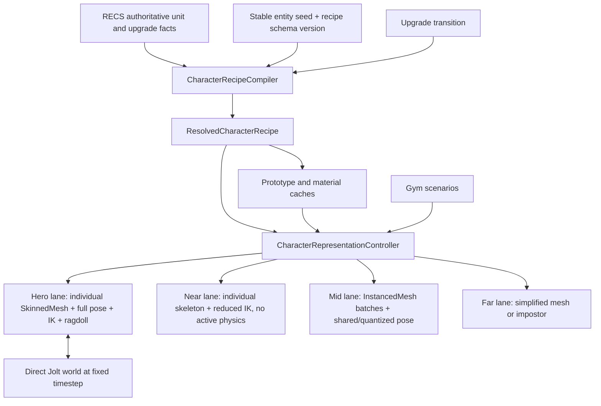

# Procedural fantasy characters, animation, and ragdolls in Three.js

**Research date:** 2026-08-21

**Repository baseline:** `apps/game` on this workspace, Three.js `0.185.1`

**Scope:** replace the current monolithic tier-specific unit GLBs with a procedurally assembled character system;
support visible upgrades, high-fidelity movement, runtime ragdolls, crowd-scale rendering, and a standalone animation
gym.

**Evidence policy:** external claims below use official documentation, specifications, project source, or maintainer
release artifacts. Each design section separates those facts from recommendations and inferences.

**Implementation decision:** JoltPhysics.js `1.1.0` is the selected and only character-physics runtime. The original
research compared Rapier first because it has the smaller JavaScript-facing API, but its JS spherical joints do not
expose the hard cone/twist limits required for believable shoulders and hips. Jolt exposes swing-twist constraints, hard
cone and twist limits, per-body solver overrides, collision-group filtering, and motors, so the project accepted its
larger lazy-loaded WASM heap and more explicit ownership model.

## Executive answer

This is feasible, but the winning architecture is not a fully generated mesh and it is not one universal rendering
representation.

The recommended system is a **canonical procedural rig plus a bounded, art-directed modular mesh kit**, rendered through
a shared TSL/NodeMaterial material family and driven by a layered procedural pose system. The current full-character,
per-tier GLBs cease to be the product abstraction. Small authored neutral bodies, armor, helmets, weapons, wings, cloth
pieces, texture masks, and normal maps may still use glTF as an offline interchange/runtime container. Runtime code
deterministically assembles them from a versioned character recipe. This is procedural character generation without
sacrificing the authored silhouettes and surface detail needed by Eternum's miniature-like fantasy aesthetic.

A second architectural decision is non-negotiable: **crowd instancing and independently simulated ragdolls are different
representations**. A nearby or selected character can own a `SkinnedMesh`, an individual skeleton, IK state, and an
11-body ragdoll. Mid/far characters should remain in bounded instanced batches with shared or quantized animation. On
impact, a representation controller promotes only eligible characters out of the crowd batch into the articulated lane,
seeds the new skeleton and rigid bodies from the exact visible pose, and later demotes or removes them. Trying to put a
unique physics skeleton for every army into the existing 1,024-slot instanced path would erase the performance reason
for that path.

The third decision follows from Eternum's renderer: **build character materials in TSL with `MeshStandardNodeMaterial`,
not GLSL `ShaderMaterial` or `onBeforeCompile` patches**. Three.js documents `ShaderMaterial` and `onBeforeCompile` as
WebGLRenderer-only, while TSL is designed to emit WGSL or GLSL. Eternum uses `WebGPURenderer` with a WebGL2 backend
fallback, so one fixed node graph with data-driven colors, masks, roughness, metalness, and emissive runes is the
maintainable dual-backend route. [Three.js ShaderMaterial](https://threejs.org/docs/pages/ShaderMaterial.html),
[Three.js Material customization](https://threejs.org/docs/pages/Material.html#onBeforeCompile),
[Three.js TSL specification](https://threejs.org/docs/TSL.html),
[Three.js WebGPURenderer](https://threejs.org/docs/pages/WebGPURenderer.html)

Use **direct, exactly pinned JoltPhysics.js `1.1.0`** for the gym and eventual game runtime. Load its separate WASM file
only with the articulated character route; own the fixed-step accumulator, bodies, constraints, collision filters, and
teardown in the character subsystem. Jolt's WebIDL bindings mirror C++ ownership: objects created with `new` require
`Jolt.destroy()`, while reference-counted shapes, constraints, and group filters require correct `AddRef()`/`Release()`
or transfer of ownership. This is more manual than Rapier, but hard swing-twist anatomy is the deciding capability.
[JoltPhysics.js package and ownership guide](https://github.com/jrouwe/JoltPhysics.js/),
[Jolt swing-twist constraint](https://jrouwe.github.io/JoltPhysics/class_swing_twist_constraint.html),
[Jolt ragdoll](https://jrouwe.github.io/JoltPhysicsDocs/5.5.0/class_ragdoll.html)

Build the **procedural animation gym first** as a lazy debug route that imports the production renderer backend and
production character modules. It should provide a turntable/art-review lane, uneven locomotion course, impact/ragdoll
arena, and deterministic stress grid. Do not make it the default worldmap representation until the same Knight recipe
passes visual, animation, backend-parity, ragdoll, lifecycle, and crowd benchmarks in the gym. A guarded one-unit world
preview is useful for scale and lighting validation before those gates.

### Implemented proof in this branch

The runnable proof is available at `/debug/procedural-characters`. The gym and an opt-in worldmap preview now consume
the same production-facing actor runtime, while the default instanced army renderer remains unchanged. It includes:

- three zero-clip, 65-bone Quaternius CC0 character GLBs: Universal Base, Peasant, and Ranger, mapped to upgrade tiers;
- one decoded asset library whose actors share geometry and textures but own independent skeletons and materials;
- procedural idle/walk/run poses with tunable cadence, stride, lift, arm swing, hip sway, torso twist, root bob, lean,
  and breathing;
- exact visible-pose handoff into 11 dynamic Jolt bodies plus one static arena body, hard swing-twist shoulders/hips,
  hinge elbows/knees, self-collision filtering, fixed stepping, impulses, sleep, pause, and single-step inspection;
- one actor API for update, configuration, reset, ragdoll, impulse, metrics, and teardown, used unchanged by the gym and
  the guarded live-army promotion layer;
- a deterministic browser smoke sequence (`animate → drop → strike → settle → evaluate`) that rejects missing bodies,
  non-finite pose/body/render transforms, missing render work, browser exceptions, and layout overflow;
- a repeatable `pnpm --dir apps/game smoke:character-gym` promotion gate with structured JSON output.

The crowd proof is available at `/debug/procedural-character-benchmark`. It uses the same actor runtime on a fully
framed 10×10 instanced hex arena and adds:

- deterministic fixed-step neighbor movement for 25, 50, 75, or 100 articulated actors;
- automatic and manual death bursts, a separately tunable Jolt-concurrency cap, corpse lifetime, and deterministic
  respawn without changing total population;
- pause, single-step, reset, seed, scale, gait, simulation-speed, shadow, and camera controls;
- average and p95 frame time, draw calls, triangles, GPU resource counts, deaths, respawns, bodies, constraints, visible
  hex count, and Jolt heap diagnostics;
- a browser gate that exercises the visible controls, 100→25→100 population churn, one complete death/respawn cycle, and
  five resets in native WebGPU and forced WebGL2.

On the test machine, the 100-actor all-hero baseline held all 100 hexes in frame with 798 draw calls, about 2.11 million
triangles, 218 geometries, 22 textures, and eight concurrent ragdolls (96 bodies and 80 constraints). The automated
samples were roughly 50–62 FPS in native WebGPU and 46–58 FPS through WebGL2 fallback. These are local baselines, not
shipping budgets. The 798-call result is direct evidence that the final ordinary-army lane still needs the planned
mid/far batching or individual-skinned-instancing representation rather than 100 hero actors.

The browser gate runs against both native WebGPU and forced WebGL2 fallback and reports bodies, constraints, draw calls,
triangles, finite transforms, browser failures, and the Jolt WASM heap. Jolt and the character assets remain lazy and
representation-gated. The Quaternius kit proves the skinned integration contract; it is not the final Eternum-quality
sculpt, modular equipment system, texture stack, or TSL material family described below.

## Recommended architecture at a glance



This has one source of truth for gameplay facts, one compiler for appearance, and multiple deliberately lossy render
representations. The gym and game use the same compiler, rig, material, animation, physics, and representation code;
only their input adapters and cameras differ.

## What exists in Eternum today

### Repository facts observed on 2026-08-21

- [`apps/game/package.json`](../../apps/game/package.json) requests Three.js `^0.185.1`; the lockfile resolves
  `0.185.1`. The official npm package also identifies `0.185.1` as the current release at the time of this research.
  [Three.js npm package](https://www.npmjs.com/package/three)
- [`renderer-build-mode.ts`](../../apps/game/src/three/renderer-build-mode.ts) defaults to `webgpu-auto`.
  [`webgpu-renderer-backend.ts`](../../apps/game/src/three/webgpu-renderer-backend.ts) constructs
  `WebGPURenderer({ forceWebGL })`, records whether native WebGPU or WebGL2 fallback is active, and already has backend
  diagnostics. [`vite.config.ts`](../../apps/game/vite.config.ts) splits `three/webgpu` into its own chunk.
- [`army-constants.ts`](../../apps/game/src/three/constants/army-constants.ts) maps Knight, Crossbowman, and Paladin at
  T1/T2/T3 to nine complete default GLBs. A local asset inspection measured those nine files at 6,590,792 bytes (6.29
  MiB) total. Each contains one mesh/node, no skin or bones, no animation, and no morph targets, with roughly 8.4k–17.6k
  vertices and 8.6k–19.7k triangles plus two 480×480 KTX2 textures.
- The current thumbnails already establish a useful art direction: dark, readable tabletop-miniature silhouettes;
  visible tier progression; a winged Knight at T3; and Paladin progression from horse to pegasus to dragon-like mount.
  The new system should preserve these authored silhouette beats instead of randomizing them away.
- [`ArmyModel`](../../apps/game/src/three/managers/army-model.ts) converts each source `Mesh` into an `InstancedMesh`,
  reserves 1,024 slots, and only has a morph-weight animation path. It samples at 20 Hz, spreads work over ten animation
  buckets, and exposes idle/moving state. Dropping in a conventional skinned GLB would therefore not work without a new
  articulated character lane.
- `ArmyModel.initializeAnimationArrays()` currently assigns animation buckets with `Math.random()`. That is harmless
  visual phase noise but is not stable character generation.
- [`army-model-materials.ts`](../../apps/game/src/three/managers/army-model-materials.ts) converts source
  `MeshStandardMaterial` to pooled `MeshBasicMaterial`, so the unit path presently discards metallic/roughness lighting.
  A high-fidelity character material is not a small patch to the existing pool; it needs a bounded PBR node-material
  family and explicit ownership.
- Cosmetics already have a [registry](../../apps/game/src/three/cosmetics/registry.ts),
  [attachment slots and pooling](../../apps/game/src/three/cosmetics/attachment-manager.ts), signatures, and
  [mount transforms](../../apps/game/src/three/managers/army-attachment-transforms.ts). The current army mount
  transforms are root-space offsets, not bone sockets. They are a useful migration seam, but articulated equipment must
  bind to canonical bones/sockets.
- Worldmap profiles use a 38° FOV at approximately 10/20/40 camera distance, army scale `0.3`, and close-view-only
  shadows. This strongly favors aggressive representation LOD: most units do not need hero articulation most of the
  time.
- The [`/debug/three-chunks` route pattern](../../apps/game/src/app.tsx) is the right lazy-loading precedent. Its
  [renderer](../../apps/game/src/three/debug/three-chunk-debug-renderer.ts) is a standalone `WebGLRenderer`; the
  character gym must instead call the
  [production renderer-backend runtime](../../apps/game/src/three/renderer-backend-runtime.ts) so the same scene can be
  exercised in native WebGPU and forced WebGL2 fallback.
- `apps/game/package.json` now declares exact `jolt-physics@1.1.0`. The separate WASM import lives behind the lazy
  `/debug/procedural-characters` route, so normal game boot does not initialize the 128 MiB Jolt heap measured by the
  browser smoke.

### Inference from the baseline

This is not a loader swap. The current units are static high-poly miniatures whose apparent animation comes from
whole-instance movement and bobbing. The requested result adds canonical bones, skin weights, procedural pose
evaluation, bone sockets, a PBR shader family, physics bodies and joints, and representation promotion. Treat it as a
new character subsystem built beside `ArmyModel`, then migrate one archetype after the gym proves it.

The present 20 Hz/bucketed instanced path remains valuable for mid/far crowds. The new system should preserve its core
performance idea and replace its source geometry/material/pose data, not turn every one of its 1,024 slots into a fully
independent hero.

## Primary-source capability findings

### Geometry, skinning, morphs, and modular parts

#### Sourced facts

- Three.js `BufferGeometry` represents positions, normals, colors, UVs, skin data, and custom attributes in GPU buffers.
  Geometry groups cause separate draw calls. Once a geometry has rendered, its morph attribute data cannot be replaced;
  a new geometry must be created. [BufferGeometry](https://threejs.org/docs/pages/BufferGeometry.html)
- `SkinnedMesh` requires a `Skeleton` plus `skinIndex` and `skinWeight` buffer attributes. It can be constructed
  manually and bound with `SkinnedMesh.bind()`. `DetachedBindMode` exists for multiple skinned meshes sharing a
  skeleton. [SkinnedMesh](https://threejs.org/docs/pages/SkinnedMesh.html)
- A Three.js `Skeleton` is an explicit bone hierarchy with inverse bind matrices and a bone-matrix buffer/texture.
  Three's own example shows constructing `Bone` objects and a `Skeleton` directly.
  [Skeleton](https://threejs.org/docs/pages/Skeleton.html)
- glTF 2.0 stores skins as joint hierarchies, inverse bind matrices, and `JOINTS_n`/`WEIGHTS_n` vertex attributes. It
  defines morphs as per-vertex deltas with the same topology and requires at least the base attribute for every morphed
  attribute. glTF animation targets node translation/rotation/scale or morph weights; it does not define game runtime
  state or material-color animation.
  [Khronos glTF 2.0 specification](https://registry.khronos.org/glTF/specs/2.0/glTF-2.0.html)
- Three.js can share a skeleton across multiple skinned meshes, and `SkeletonUtils.clone()` correctly reconnects cloned
  skinned meshes and bones while reusing geometry and material references. `SkeletonUtils.retarget()` and
  `retargetClip()` can map animation between skeletons.
  [SkeletonUtils](https://threejs.org/docs/pages/module-SkeletonUtils.html)
- `BufferGeometryUtils.mergeGeometries()` can combine compatible geometries. That can reduce objects/draw calls, but
  geometry groups still render separately and all merged attributes must remain compatible.
  [BufferGeometryUtils](https://threejs.org/docs/pages/module-BufferGeometryUtils.html),
  [BufferGeometry groups](https://threejs.org/docs/pages/BufferGeometry.html#groups)

#### Recommendation and inference

Do not make “procedural” mean “every final vertex comes from capsules and noise.” That approach is attractive for
payload size and deterministic silhouettes, but it shifts character sculpting, deformation topology, skin weighting,
UVs, and every armor seam into code. It is suitable for a grey-box body and stylized low-detail LOD, not the default
route to high-fidelity fantasy art.

Use this split:

| Concern             | Procedural at runtime                                                                 | Authored once, modular at runtime                                                                                                   |
| ------------------- | ------------------------------------------------------------------------------------- | ----------------------------------------------------------------------------------------------------------------------------------- |
| Identity            | stable seed, proportions, palette, gait phase                                         | archetype art direction                                                                                                             |
| Base shape          | bounded bone scales and 2–4 body-shape classes; optional small same-topology morphs   | one neutral topology per body class with deliberate joint loops and skin weights                                                    |
| Silhouette upgrades | selection, placement, scale-in transition                                             | helmets, pauldrons, cuirasses, weapons, wings, mounts, banners                                                                      |
| Fine fantasy detail | TSL palette, wear, rune intensity, emissive pulse                                     | mask maps, normal/ORM detail, trim sheets                                                                                           |
| Animation           | locomotion phase, balance, aim, terrain response, IK, secondary motion, physics blend | a small set of authored key poses/clips for attacks, deaths, and signature class motion where procedural motion alone looks generic |
| Physics             | body/joint generation from a profile and current rig proportions                      | per-archetype collider/joint tuning data reviewed in the gym                                                                        |

The unit of reuse should be a **canonical rig contract**, not a complete character file. An artist may still deliver a
helmet or neutral skinned cuirass as GLB; glTF remains a good standardized delivery container. Eliminating GLB by
converting the same bytes into TypeScript arrays would lose tooling and compression without making the character more
procedural. The meaningful replacement is “nine monolithic full-character tier assets” → “one rig and a bounded kit
compiled into deterministic recipes.”

Use fully procedural geometry only for shapes that benefit from parameterization and tolerate simpler topology:
under-armor proxy bodies, horns, spikes, rings, aura bands, banners, weapon trails, capes at lower LOD, and
collision/debug meshes. Generate these once per bounded geometry signature, compute normals/tangents/bounds once, cache
them, and never rebuild topology per frame. Palette, gait phase, wear, and rune state must not enter the geometry-cache
key.

### Skeletal animation, procedural pose composition, and IK

#### Sourced facts

- `AnimationMixer` evaluates animation for a scene object; independently animated objects may have their own mixers.
  `AnimationAction` supports blend weights, additive/normal modes, time scaling, fades, and cross-fades.
  `AnimationObjectGroup` can apply one compatible animation state to multiple objects.
  [AnimationMixer](https://threejs.org/docs/pages/AnimationMixer.html),
  [AnimationAction](https://threejs.org/docs/pages/AnimationAction.html),
  [AnimationObjectGroup](https://threejs.org/docs/pages/AnimationObjectGroup.html)
- Three.js ships `CCDIKSolver` for a `SkinnedMesh`. Its IK definition supports a target, effector, linked bones,
  per-link rotation limits, iteration count, per-step angular limits, and a blend factor. The official skinning/IK and
  skinning/blending examples demonstrate the supported runtime path.
  [CCDIKSolver](https://threejs.org/docs/pages/CCDIKSolver.html),
  [official IK example](https://threejs.org/examples/webgl_animation_skinning_ik.html),
  [official blending example](https://threejs.org/examples/webgl_animation_skinning_blending.html)
- `Quaternion.slerp()` performs spherical rotation interpolation, and `rotateTowards()` applies a bounded angular step.
  These are the correct primitives for blending local bone rotations and rate-limiting procedural aim/look motion.
  [Quaternion](https://threejs.org/docs/pages/Quaternion.html)
- `Raycaster` returns world-space hit points and interpolated normals and can filter by layers. Rapier also provides
  scene ray/shape queries with filters. Either can supply ground contact targets; using the physics world's query when
  it is active avoids a second, disagreeing collision surface.
  [Three.js Raycaster](https://threejs.org/docs/pages/Raycaster.html),
  [Rapier scene queries](https://rapier.rs/docs/user_guides/javascript/scene_queries/)
- Three.js r185 includes an official WebGPU example that computes independent skinned poses for instances using storage
  buffers and a compute pass. It also changes body proportions and per-instance morph weight in the same example.
  However, the example explicitly aborts when WebGPU is unavailable, so it is not a WebGL2-fallback solution.
  [r185 individual skinning-instancing source](https://github.com/mrdoob/three.js/blob/r185/examples/webgpu_skinning_instancing_individual.html)
- The original FABRIK paper describes an iterative IK solver designed for smooth, rapid end-effector convergence, while
  SIMBICON shows that compact pose-control graphs plus PD control can synthesize families of physical gaits—and also
  explains why fully dynamics-driven biped locomotion is a difficult, high-dimensional control problem.
  [FABRIK paper](https://andreasaristidou.com/publications/papers/FABRIK.pdf),
  [SIMBICON paper](https://www.cs.sfu.ca/~kkyin/papers/Yin_SIG07.pdf)
- Lasseter's SIGGRAPH paper applies timing, anticipation, follow-through, overlapping action, staging, and the other
  traditional animation principles to 3D computer animation. Those qualities, not triangle count alone, are part of the
  visual-fidelity gate for procedural attacks and reactions.
  [Principles of Traditional Animation Applied to 3D Computer Animation](https://doi.org/10.1145/37402.37407)

#### Recommendation and inference

Represent animation as a pose pipeline, not as callbacks that mutate arbitrary bones. A pose is a dense, canonical array
of local bone rotations plus root/pelvis translation and optional bone scale. Every layer consumes and returns that
contract:

1. Resolve motion state and continuous parameters: ground speed, turn rate, attack phase, hit direction, aim target.
2. Generate a base pose: procedural idle/walk/run or an authored action clip/key pose.
3. Apply additive style: class stance, breathing, anticipation, recoil, look/aim, hand grips, cape/weapon secondary
   motion.
4. Resolve ground samples and foot contact locks.
5. Solve pelvis height, then leg and arm IK.
6. Convert any physics-body transforms into a local bone pose and blend them using the ragdoll state machine.
7. Write the final local pose to the skeleton once, in hierarchy order.

This ordering keeps one truth for the visible pose and makes animation-to-ragdoll handoff testable. It also lets the
same animation core target an individual `Skeleton` or write quantized samples into a crowd-pose buffer.

For locomotion, advance gait phase from **distance traveled divided by stride length**, not elapsed time alone. Generate
pelvis bob/lean, counter-rotate chest and arms, and derive swing/stance curves from the phase. During stance, lock a
foot target in world space; sample the terrain under that target; move the pelvis within a bounded range; solve
hip-knee-ankle with a stable pole direction; align the foot to a filtered ground normal; and blend the lock in/out
around contact boundaries. This eliminates the two most visible procedural-animation defects: sliding feet and snapping
knees.

Keep root motion owned by Eternum's existing world-position and spline-movement path. The pose pipeline consumes
distance, velocity, direction, and terrain samples to animate in place; it does not advance the gameplay root. This
avoids a second movement simulation disagreeing with RECS. Physics gains temporary root authority only after promotion
to a presentation-only ragdoll, and that result never feeds back into gameplay state.

Use Three's CCD solver in the gym to validate bone names, targets, limits, and visual direction quickly. For production
humanoid legs, prefer a small analytic two-bone solver if measurement shows CCD iterations are a meaningful cost or hard
to stabilize. It should clamp unreachable targets, preserve the knee pole, and return the pre-IK pose on invalid input.
Keep CCD for longer chains or editor/debug comparison. This is a recommendation, not a claim that CCD is inadequate.

Do not require all motion to be procedural. Procedural locomotion, terrain adaptation, aim, and secondary motion produce
responsiveness and variation. A compact, shared authored library of attack, hit, death, and class-signature clips or key
poses preserves deliberate timing and readable fantasy combat. Three's mixer/action system can blend these, but the
character runtime should translate mixer output into the same canonical pose before IK/physics rather than letting two
systems write the skeleton independently.

Recommended canonical rig (names are a contract, not artist preference):

| Rig role       | Render bones                                                               | Physics proxy       | Important sockets                  |
| -------------- | -------------------------------------------------------------------------- | ------------------- | ---------------------------------- |
| World/root     | `root`, `motion`                                                           | none                | `aura`, `ground_fx`                |
| Center         | `pelvis`, `spine_01`, `spine_02`, `neck`, `head`                           | pelvis, chest, head | `belt`, `back`, `chest`, `head`    |
| Arms, mirrored | `clavicle`, `upper_arm`, optional twist, `forearm`, optional twist, `hand` | upper arm, forearm  | `hand_grip`, `forearm`, `shoulder` |
| Legs, mirrored | `thigh`, optional twist, `shin`, `foot`, `toe`                             | thigh, shin         | `foot_fx`                          |

Twist bones, fingers, toes, cloth chains, wings, tails, and mount rigs may improve a hero, but they should not receive
physics bodies by default. Keep the physical skeleton coarse and map it to the richer render skeleton. Every modular
part must declare its compatible rig version, bind pose, units, forward/up axes, skin attributes, material mask layout,
bounds, LODs, and socket/collider metadata. Reject incompatible parts loudly in the gym.

### Shader and material architecture under WebGPU + WebGL2 fallback

#### Sourced facts

- `WebGPURenderer` selects native WebGPU when available and otherwise uses its WebGL2 backend; `forceWebGL` explicitly
  selects the fallback. That exactly matches Eternum's renderer modes.
  [WebGPURenderer](https://threejs.org/docs/pages/WebGPURenderer.html)
- Three.js documents `ShaderMaterial` as usable only with `WebGLRenderer`. It likewise documents
  `Material.onBeforeCompile()` and `customProgramCacheKey()` as WebGLRenderer-only and recommends Node Material/TSL for
  customization. [ShaderMaterial](https://threejs.org/docs/pages/ShaderMaterial.html),
  [Material](https://threejs.org/docs/pages/Material.html)
- TSL is renderer-agnostic and can encode its graph as WGSL for WebGPU or GLSL for WebGL. It exposes attributes,
  instance indices, transformed positions/normals, uniforms, textures, storage, and the high-level node-material slots.
  [Three.js Shading Language](https://github.com/mrdoob/three.js/wiki/Three.js-Shading-Language),
  [TSL reference](https://threejs.org/docs/TSL.html)
- `MeshStandardNodeMaterial` preserves the standard PBR lighting model while allowing `emissiveNode`, `metalnessNode`,
  and `roughnessNode` overrides; the general node-material API also exposes `colorNode`, `normalNode`, and
  `positionNode`. [MeshStandardNodeMaterial](https://threejs.org/docs/pages/MeshStandardNodeMaterial.html),
  [TSL NodeMaterial slots](https://threejs.org/docs/TSL.html#NodeMaterial)
- `MeshStandardMaterial` uses metallic/roughness PBR and benefits from an environment map. Normal maps alter lighting
  but not silhouette; displacement alters vertex position and needs corresponding normal treatment for best results.
  [MeshStandardMaterial](https://threejs.org/docs/pages/MeshStandardMaterial.html)
- Setting `Material.needsUpdate` recompiles a material. Keeping feature topology fixed and changing uniform/attribute
  values avoids an unbounded family of shader permutations.
  [Material.needsUpdate](https://threejs.org/docs/pages/Material.html#needsUpdate)
- KTX2/Basis textures can be transcoded to GPU-supported compressed formats. Three's `KTX2Loader.detectSupport()`
  accepts `WebGPURenderer` or `WebGLRenderer`, and the Khronos extension specifies Basis textures for more efficient
  transfer and lower GPU memory, with ETC1S generally used for color and UASTC for non-color texture data.
  [KTX2Loader](https://threejs.org/docs/pages/KTX2Loader.html),
  [KHR_texture_basisu](https://github.com/KhronosGroup/glTF/blob/main/extensions/2.0/Khronos/KHR_texture_basisu/README.md)

#### Recommendation and inference

Build one fixed `MeshStandardNodeMaterial` graph per bounded material quality class, not one material program per
character or upgrade. Feed it a compact character parameter block:

```ts
interface CharacterSurfaceParameters {
  ownerColor: Color;
  clothColor: Color;
  tierAccent: Color;
  metalness: number;
  roughness: number;
  runeIntensity: number;
  wear: number;
  upgradeBlend: number;
}
```

Use packed mask texture channels to assign cloth/leather/metal/rune zones. Keep owner/heraldry color semantically stable
and use a separate tier accent/metal finish/rune intensity for progression, otherwise player identity and upgrade status
fight for the same color channel. A practical graph is:

- `colorNode`: mix cloth, leather, metal, owner heraldry, and tier accent by mask channels;
- `metalnessNode` / `roughnessNode`: derive bounded surface response from the same masks and compact ORM texture;
- `normalNode`: shared tiled/atlas normal detail, with high-frequency detail removed at lower LOD;
- `emissiveNode`: masked rune color multiplied by a scalar pulse and visibility budget;
- optional `positionNode`: small cloth/rune breathing only; do not use shader displacement for major silhouette upgrades
  or anything physics must collide with.

Use instance color or custom instanced attributes for per-instance palette/upgrade data in the crowd lane. TSL exposes
arbitrary geometry attributes and `instanceIndex`, and Three's `InstancedMesh` already has per-instance color and
morph-weight storage. Update only dirty attribute ranges, which matches existing Eternum buffer discipline.
[TSL attributes](https://threejs.org/docs/TSL.html#Attributes),
[InstancedMesh](https://threejs.org/docs/pages/InstancedMesh.html),
[BufferAttribute update ranges](https://threejs.org/docs/pages/BufferAttribute.html#updateRanges)

Avoid compile-time `define` combinations for helmets, runes, damage, or tier. Use scalar zero to disable a bounded
effect in the fixed graph. Geometry that changes topology remains an attachment/batch signature. Precompile the small
set of material/geometry signatures before an upgrade reveal to avoid a visible shader hitch.

Treat the official r185 compute-based individual skinning example as a future WebGPU optimization, not the base
architecture. Its storage buffers, per-instance bone matrices, and compute pass prove the technique is possible, but its
explicit WebGPU-only guard violates Eternum's fallback contract. The first production character path must use APIs that
pass both native WebGPU and forced WebGL2. A later compute lane is acceptable only as an optional acceleration with a
tested visual and functional fallback.

### Visible upgrades and deterministic character morphology

#### Sourced facts

- glTF morph targets preserve topology and are weighted vertex deltas. They are appropriate for continuous,
  same-topology changes but cannot add a helmet, weapon, wing, or other new topology.
  [glTF morph targets](https://registry.khronos.org/glTF/specs/2.0/glTF-2.0.html#morph-targets)
- `InstancedMesh` stores per-instance matrices and colors and can store per-instance morph weights in a `DataTexture`.
  Its purpose is to reduce draw calls for many objects sharing geometry and material.
  [InstancedMesh](https://threejs.org/docs/pages/InstancedMesh.html)
- `MathUtils.seededRandom(seed)` returns a deterministic pseudo-random value. By contrast, the current unit animation
  phase uses `Math.random()`. [MathUtils.seededRandom](https://threejs.org/docs/pages/MathUtils.html#seededRandom)
- Rapier's deterministic guarantee is conditional on identical inputs and identical insertion/removal order. Its current
  npm package separates the normal, SIMD, and deterministic builds; the normal build promises local rather than
  cross-platform determinism, and the deterministic build trades optimization for the stronger guarantee.
  [Rapier npm feature selection](https://www.npmjs.com/package/@dimforge/rapier3d),
  [Rapier determinism guide](https://rapier.rs/docs/user_guides/javascript/determinism/)

#### Recommendation and inference

Compile every appearance from a small, serializable, versioned recipe:

```ts
interface ResolvedCharacterRecipe {
  schemaVersion: number;
  entitySeed: number;
  archetype: "knight" | "crossbowman" | "paladin";
  bodyClass: "lean" | "standard" | "heavy" | "heroic";
  proportions: Readonly<Record<ProportionChannel, number>>;
  palette: CharacterPalette;
  upgradeTier: 1 | 2 | 3;
  attachmentIds: readonly string[];
  gaitProfileId: string;
  ragdollProfileId: string;
}
```

The input seed should come from stable entity/world identity and the recipe schema version. Run a project-owned PRNG
stream (or a wrapped, tested Three seeded generator), use named substreams for body/palette/equipment/phase, quantize
outputs, sort attachment IDs, and serialize a canonical form for hashing. A schema-version change intentionally changes
output; ordinary refactors must not.

Do not expose arbitrary continuous body proportions in the crowd lane. Bound them to a handful of art-reviewed body
classes so instances still share geometry and animation data. Individual hero characters may use additional
bone-scale/morph variation. This prevents a deterministic generator from creating an unbounded geometry cache.

Classify upgrade visuals by mechanism:

| Upgrade change          | Mechanism                   | Example                                        |
| ----------------------- | --------------------------- | ---------------------------------------------- |
| Continuous surface      | node-material parameter     | cloth darkens, metal changes, runes brighten   |
| Same-topology shape     | bounded morph or bone scale | heavier chest, longer cloak, broader mount     |
| New topology/silhouette | modular attachment          | helmet crest, pauldrons, wings, banner, weapon |
| Transient reveal        | short-lived effect          | rune sweep, sparks, aura ring                  |

An upgrade transition should be a small transaction: resolve the next recipe from authoritative state; ensure the
prototype/material/attachments are ready; animate `upgradeBlend` and attachment scale/emissive; atomically move the
crowd instance between bounded batch signatures if topology changed; then release the old representation. Never show a
missing character while assets compile. Never store a second gameplay tier in the character subsystem.

## Crowd rendering, LOD, and the ragdoll incompatibility

### Sourced facts

- `InstancedMesh` reduces draw calls when all instances share geometry and material. Its built-in varying state is the
  whole-object transform, color, and morph weights; its public API has no independent per-instance `Skeleton`.
  [InstancedMesh](https://threejs.org/docs/pages/InstancedMesh.html)
- The official r185 shared-pose skinning-instancing example uses one skeleton/mixer pose for every instance. The
  official independent-pose example is custom CPU sampling plus WebGPU storage buffers and a compute skinning pass; it
  does not turn a stock `InstancedMesh` into many ordinary skeleton objects.
  [r185 shared-pose example](https://github.com/mrdoob/three.js/blob/r185/examples/webgpu_skinning_instancing.html),
  [r185 independent-pose example](https://github.com/mrdoob/three.js/blob/r185/examples/webgpu_skinning_instancing_individual.html)
- `BatchedMesh` can put multiple different geometries using one material into a batch, assign a geometry ID and
  transform per instance, and manage per-instance colors/visibility. It is a candidate for a bounded catalog of rigid
  pieces, not evidence that it will outperform every `InstancedMesh` layout.
  [BatchedMesh](https://threejs.org/docs/pages/BatchedMesh.html)
- Three's `LOD` switches object representations at configured distances and supports hysteresis to reduce boundary
  flicker. It does not automatically lower animation, IK, or physics update frequency.
  [LOD](https://threejs.org/docs/pages/LOD.html)
- Animated `SkinnedMesh` exact bounds must follow the animated vertices; Three documents that bounds may need
  recomputation per frame. A crowd should therefore use reviewed conservative bounds instead of CPU-skinning all
  vertices only to cull them. [SkinnedMesh bounds](https://threejs.org/docs/pages/SkinnedMesh.html#computeBoundingBox)
- The classic WebGL renderer exposes draw calls, triangles, geometry/texture counts, and shader programs through
  `renderer.info`; the common renderer's `Info` also exposes draw calls, triangles, compute calls, and buffer/texture
  memory. [WebGLRenderer.info](https://threejs.org/docs/pages/WebGLRenderer.html#info),
  [Renderer Info](https://threejs.org/docs/pages/Info.html)

### Recommendation and inference

Use independent but coordinated visual, animation, and physics LODs:

| Lane | Selection rule                             | Rendering                                                               | Animation                                                        | Physics                                  |
| ---- | ------------------------------------------ | ----------------------------------------------------------------------- | ---------------------------------------------------------------- | ---------------------------------------- |
| Hero | selected, struck, cinematic, or very close | individual modular `SkinnedMesh`, full PBR, shadow, all key attachments | full-rate pose layers, terrain IK, secondary motion              | ragdoll-capable; active only when needed |
| Near | close enough to read limbs                 | individual skeleton or small compatible group, reduced material         | reduced cadence; IK only when feet are readable                  | no limb bodies until promoted            |
| Mid  | normal worldmap army view                  | `InstancedMesh` by bounded archetype/tier/attachment signature          | shared or quantized pose buckets and deterministic phase offsets | none                                     |
| Far  | below a projected-size threshold           | simplified instanced silhouette or impostor                             | coarse phase or no articulation                                  | none                                     |

Use camera distance plus projected screen size and “interest” (selected, local player, in combat, just hit), with
hysteresis and a residency delay so characters do not churn between lanes. The exact thresholds are a measured product
decision for the gym, not constants to guess in this paper.

Why a crowd instance cannot simply ragdoll in place:

1. A ragdoll needs an independent transform for each physical limb.
2. A normal instance supplies one transform for the complete rendered mesh.
3. Independent skinned instancing needs a separate bone matrix set per instance and custom GPU data/compute work.
4. Jolt still needs individual bodies, shapes, constraints, and CPU-visible transforms for every active ragdoll.
5. Eternum must retain WebGL2 fallback, while Three's r185 independent-pose compute example explicitly requires WebGPU.

Therefore promotion is the clean contract: read the instance's recipe, world transform, gait phase, and sampled visible
pose; allocate an articulated character from a pool; copy the pose without a frame gap; remove or zero only that
entity's batch slot; then enable its ragdoll. Demotion performs the inverse only after the body has recovered or the
corpse representation expires. Draw-call batching and ragdoll fidelity are both preserved because they do not occupy the
same representation at the same time.

Batch by **bounded topology signature**, not by entity seed. For example, `knight:t2:crest+shield:mid` is a batch; its
entity colors, wear, gait phase, and rune intensity are attributes. When an attachment is a rigid unskinned catalog
part, benchmark these two layouts in the gym on both backends:

- one `InstancedMesh` per attachment geometry/signature;
- one capacity-planned `BatchedMesh` per shared material containing the finite catalog.

Do not assume `BatchedMesh` wins. Fix its catalog and capacity before first draw, measure update cost and culling, and
retain the simpler instanced layout unless the evidence is clear. This repository has already encountered renderer-owned
buffer-identity constraints; character batch buffers should likewise be capacity-planned rather than replaced while
live.

Do not let active corpses accumulate. Sleeping bodies are cheaper but their individual skeletons, draw calls, body
records, and GPU skinning remain. Establish a measured active-ragdoll budget, then recover, freeze to a deliberately
cheap corpse representation, or fade/despawn according to gameplay semantics. The benchmark matrix should cover 0, 1, 8,
16, and 32 simultaneous ragdolls before choosing the cap.

## Physics-engine evaluation and selected Jolt ragdoll design

### Rapier comparison facts

- The current official JavaScript release at this research date is `0.20.0`, released 2026-08-08 and backed by Rapier
  Rust `0.35.0`. The former `dimforge/rapier.js` repository is archived because the bindings moved into the main Rapier
  repository.
  [Rapier JS 0.20 changelog](https://github.com/dimforge/rapier/blob/js-v0.20.0/typescript/CHANGELOG.md#0200-08-august-2026),
  [repository migration notice](https://github.com/dimforge/rapier.js)
- Rapier is asynchronous WASM at initialization. The official packages offer standard, SIMD, deterministic, and
  `-compat` variants; `-compat` embeds WASM in JavaScript for broader bundler support at greater bundle size.
  [Rapier JS README](https://github.com/dimforge/rapier/blob/js-v0.20.0/typescript/README.md)
- Rapier distinguishes dynamic, fixed, position-based kinematic, and velocity-based kinematic bodies. Position-based
  kinematics should use `setNextKinematicTranslation()` / `setNextKinematicRotation()` so the engine derives a velocity
  for contacts. `setBodyType()` enables a transition to dynamic.
  [Rapier 0.20 rigid-body source](https://github.com/dimforge/rapier/blob/js-v0.20.0/typescript/src.ts/dynamics/rigid_body.ts)
- Colliders create contact shape and mass/inertia for bodies. Rapier provides balls, capsules, cuboids, rounded shapes,
  convex hulls, and triangle meshes, but explicitly discourages triangle meshes on dynamic bodies. It recommends
  density/mass-based automatic mass properties because incoherent inertia and centers of mass produce odd behavior.
  [Rapier colliders](https://rapier.rs/docs/user_guides/javascript/colliders/),
  [collider mass properties](https://rapier.rs/docs/user_guides/javascript/collider_mass_properties/)
- Rapier describes spherical joints as a normal shoulder/ragdoll primitive. Revolute joints support a single free
  angular axis and hard limits. Impulse joints are flexible but may drift if the solver does not converge; multibody
  joints are structurally stable trees, though the current JS multibody motor surface is not the practical
  active-ragdoll route. [Rapier joints](https://rapier.rs/docs/user_guides/javascript/joints/),
  [joint model comparison](https://rapier.rs/docs/user_guides/javascript/joint_constraints/),
  [0.20 multibody binding](https://github.com/dimforge/rapier/blob/js-v0.20.0/typescript/src.ts/dynamics/multibody_joint.ts)
- Rapier 0.20 exposes per-axis spherical-joint motor targets, stiffness, damping, velocity, and maximum torque. Its
  public spherical joint still exposes no hard angular-limit setter and there is no public cone-twist joint. This is the
  largest technical risk to anatomically convincing shoulders and hips.
  [0.20 spherical motor change](https://github.com/dimforge/rapier/blob/js-v0.20.0/typescript/CHANGELOG.md#added),
  [tagged joint binding](https://github.com/dimforge/rapier/blob/js-v0.20.0/typescript/src.ts/dynamics/impulse_joint.ts#L424-L525)
- A rigid body may request additional solver iterations for only its contact/joint-connected island, avoiding a global
  accuracy increase. Joint-linked bodies can disable contacts, collision groups can reject larger classes of pairs, and
  sleeping bodies are removed from active simulation until woken.
  [0.20 rigid-body solver iterations](https://github.com/dimforge/rapier/blob/js-v0.20.0/typescript/src.ts/dynamics/rigid_body.ts#L241-L263),
  [ImpulseJoint contacts](https://rapier.rs/javascript3d/classes/ImpulseJoint.html),
  [collision groups](https://rapier.rs/docs/user_guides/javascript/colliders/#collision-groups-and-solver-groups),
  [sleeping](https://rapier.rs/docs/user_guides/javascript/rigid_body_sleeping/)
- `World.timestep` should be small and not vary substantially. The default integration timestep is 1/60 second; smaller
  steps improve accuracy while large steps can miss collisions or amplify approximation error. Three's own physics guide
  also recommends fixed physics steps.
  [Rapier integration parameters](https://rapier.rs/docs/user_guides/javascript/integration_parameters/),
  [Rapier 0.20 `World.timestep`](https://github.com/dimforge/rapier/blob/js-v0.20.0/typescript/src.ts/pipeline/world.ts#L309-L329),
  [Three.js physics guide](https://threejs.org/manual/en/physics.html)
- `World.debugRender()` returns line/color buffers, and enabling the world profiler exposes whole-step, collision,
  solver, CCD, and other timings. [Rapier World API](https://rapier.rs/javascript3d/classes/World.html),
  [0.20 timing source](https://github.com/dimforge/rapier/blob/js-v0.20.0/typescript/src.ts/pipeline/world.ts#L1141-L1305)

### Why direct Jolt rather than Three's Rapier addon

The Three r185 addon is useful for simple mesh physics, but its source imports `@dimforge/rapier3d-compat@0.17.3` from a
CDN, creates its own world, owns a 60 Hz `setInterval`, assigns the render delta to `world.timestep`, and synchronizes
whole mesh transforms. Although it exposes the underlying world in r185, adopting it would still give the character
subsystem a hidden scheduler, an external dependency version, and the wrong mesh-root abstraction.
[Three.js r185 `RapierPhysics.js`](https://github.com/mrdoob/three.js/blob/r185/examples/jsm/physics/RapierPhysics.js)

The selected integration pins `jolt-physics@1.1.0` and imports `jolt-physics/wasm` plus `jolt-physics.wasm.wasm?url`.
`JoltInterface.Step(fixedStep, collisionSteps)` is called only by the gym-owned fixed-step accumulator. The production
renderer and Jolt module initialize in parallel behind the lazy route. Body and constraint construction is isolated in
`jolt-character-ragdoll.ts`; callers see only character-domain operations such as drop, strike, update parameters, write
part transforms, and dispose.

The ownership boundary is part of correctness, not cleanup polish. During the browser proof, destroying the
reference-counted `GroupFilterTable` wrapper after body creation left collision groups pointing at freed WASM memory and
stalled the browser on the first physics step. Holding a reference across construction and releasing it after body
ownership transferred fixed the failure. The smoke gate exists partly to keep this class of lifecycle bug visible.

### Recommended physical skeleton

Start with 11 bodies, not one body per render bone:

| Body                 | Collider               | Joint to parent        | Notes                               |
| -------------------- | ---------------------- | ---------------------- | ----------------------------------- |
| pelvis               | rounded cuboid/capsule | root body              | authoritative ragdoll/root position |
| chest                | capsule/rounded cuboid | constrained spine      | modest flex, high damping           |
| head                 | sphere/capsule         | constrained neck       | no face/helmet collider detail      |
| left/right upper arm | capsule                | swing-twist shoulder   | hard cone/twist limits              |
| left/right forearm   | capsule                | limited revolute elbow | disable adjacent-body contact       |
| left/right thigh     | capsule                | swing-twist hip        | hard cone/twist limits              |
| left/right shin      | capsule                | limited revolute knee  | disable adjacent-body contact       |

Hands, feet, toes, twist bones, fingers, wings, cloth, helmet crests, and most weapons follow render bones and do not
get bodies in the first implementation. This keeps mass and constraint count low and prevents decorative geometry from
destabilizing the solver. Add an optional weapon body only after the base ragdoll is stable and its gameplay value is
visible.

Build body dimensions, local body-to-bone offsets, joint anchors/frames, densities, damping, motor presets, and allowed
collision pairs from a versioned `RagdollProfile`. Derive dimensions from the resolved rig proportions, then clamp them
to reviewed ranges. Use primitive colliders, automatic density-based inertia, and higher mass toward pelvis/chest.
Disable contacts on adjacent linked bodies; decide non-adjacent self-collision from gym evidence rather than disabling
everything globally.

Elbows and knees use hard-limited hinge constraints. Shoulders, hips, spine, and neck use Jolt swing-twist constraints
with independently tunable swing cones and twist ranges. The current proxy uses direct body/constraint construction
rather than Jolt's higher-level native `RagdollSettings`: this keeps the first browser-facing contract small and makes
every body, limit, collision pair, and lifetime visible in the gym. Revisit `RagdollSettings` only when the canonical
skinned rig and active motor targets justify its skeleton-mapping machinery.
[Jolt `Ragdoll`](https://jrouwe.github.io/JoltPhysicsDocs/5.5.0/class_ragdoll.html),
[Jolt ragdoll samples](https://github.com/jrouwe/JoltPhysics/blob/master/Docs/Samples.md),
[Jolt skeleton mapper](https://jrouwe.github.io/JoltPhysics/hierarchy.html)

### Animation-to-ragdoll ownership and blending

#### Sourced facts

- Jolt separates static, kinematic, and dynamic bodies. Dynamic bodies should enter ragdoll mode from the exact current
  visual transform and then be advanced by the physics system rather than repeatedly teleported.
  [Jolt body interface](https://jrouwe.github.io/JoltPhysicsDocs/5.5.0/class_body_interface.html)
- Jolt swing-twist and hinge constraints expose motor state and spring settings as well as hard angular limits. They
  provide the later active-ragdoll path without weakening the passive-ragdoll anatomy used by the first proof.
  [Jolt swing-twist constraint](https://jrouwe.github.io/JoltPhysics/class_swing_twist_constraint.html),
  [Jolt hinge constraint](https://jrouwe.github.io/JoltPhysics/class_hinge_constraint.html)
- Three quaternions require normalization and support spherical interpolation.
  [Quaternion](https://threejs.org/docs/pages/Quaternion.html)

#### Recommendation and inference

Use two pose authorities and one explicit state machine:

```text
Animated -> BlendToActiveRagdoll -> ActiveRagdoll -> PassiveRagdoll
   ^                                      |               |
   +------------- Recovering <------------+---------------+
```

- **Animation target pose:** procedural/clip/IK output. If `AnimationMixer` is used, evaluate it on a hidden target rig
  because it mutates its object hierarchy.
- **Physics pose:** body transforms converted back into canonical local bone rotations.
- **Rendered pose:** the state machine's selected or blended output, written once to the visible skeleton.

Calibrate and persist a `bodyToBoneBind` matrix for every physics body:

```text
bodyToBoneBind = inverse(bodyWorldBind) * boneWorldBind
boneWorldFromPhysics = bodyWorld * bodyToBoneBind
boneLocalFromPhysics = inverse(parentBoneWorld) * boneWorldFromPhysics
```

Apply translation from physics only to the character root/pelvis. For ordinary child bones, preserve rest-pose local
translation/scale and copy or slerp the computed local rotation; this preserves limb length and prevents the render
hierarchy from stretching when constraints have small error.

On promotion/impact:

1. Evaluate the exact pose that was visible in the crowd lane, including gait phase and world transform.
2. Create/enable bodies in a deterministic parent-first order and initialize each body from the bone-world pose and
   calibrated offset.
3. Estimate root and limb velocities from the last two visible poses where available; at minimum seed every body with
   the character's root linear velocity.
4. Switch bodies to dynamic, wake them, and apply the gameplay-provided impulse at the appropriate body/point.
5. Over a short art-tuned window, fade motor strength down and/or slerp the rendered local pose from animation to
   physics. Physics owns colliders immediately; visual slerp is polish, not two competing simulations.

For a fatal hit, use a brief active/stiff phase to preserve the struck pose and class silhouette, then fade to passive
ragdoll and eventually sleep/freeze/fade. For a non-fatal knockdown, retain animation targets and raise motor strength
for an active ragdoll, choose a face-up/face-down get-up pose from pelvis orientation, align the animation root to the
grounded pelvis, and only return full authority after the bodies and visible skeleton converge. A purely visual blend
while colliders remain far away will cause contact/mesh separation; prefer motor-based convergence when the character
must recover physically.

Do not promise a polished active ragdoll merely because hard limits now exist. Passive impact/death ragdoll is the first
deliverable. Active motors and recovery are a second gate after shoulder/hip behavior, collision filtering, target-pose
tracking, and solver cost are measured.

### Fixed-step loop and presentation determinism

Use one owned physics step in the production animation runtime, not a separate timer:

```ts
accumulator += Math.min(frameDelta, maxAcceptedFrameDelta);

while (accumulator >= fixedStep && steps < maxCatchUpSteps) {
  writeAnimatedKinematicTargets();
  jolt.Step(fixedStep, collisionSteps);
  capturePreviousAndCurrentBodyTransforms();
  accumulator -= fixedStep;
  steps++;
}

interpolatePhysicsForRendering(accumulator / fixedStep);
```

Start at the documented/default 1/60 second. Smaller steps are an accuracy/performance trade only the gym should
authorize. Cap accumulated wall time and catch-up steps after a suspended tab to avoid a spiral; cosmetic ragdolls may
drop backlog rather than stall gameplay. Interpolate previous/current body transforms for smooth rendering without
changing simulation state.

Keep two determinism goals separate:

1. **Character identity determinism is required.** The same schema version, stable identity, authoritative upgrade
   facts, and kit registry must compile to the same canonical recipe and geometry/material signature on every run. This
   is cheap and should have test vectors.
2. **Cross-platform physics determinism is optional and not promised by the selected npm artifact.** Pin Jolt, construct
   bodies/constraints in canonical order, and drive a fixed number of fixed-size steps for repeatable same-build gym
   fixtures. If exact cross-platform ragdoll replay becomes a product requirement, it needs a separately compiled Jolt
   build with `CROSS_PLATFORM_DETERMINISTIC` plus a conformance suite; do not infer that guarantee from fixed stepping.
   [JoltPhysics.js build options](https://github.com/jrouwe/JoltPhysics.js/)

The normal package is sufficient when the onchain state transition is authoritative and ragdoll outcome is presentation.
A battle event may enrich the reaction with an impact point and impulse, but the durable RECS result must remain
sufficient: tier changes compile the final upgraded recipe, and defeat/removal can trigger a deterministic fallback
death reaction from the last visible pose if the event stream is unavailable. Never feed a limb landing position back
into RECS/gameplay unless the entire simulation becomes an explicitly specified gameplay system. For the current
cosmetic use case, deterministic scenario inputs and invariant-based outcomes are a better regression contract than
byte-identical final corpse transforms.

## The procedural animation gym

### Product requirement

The gym is a production subsystem harness, not a disposable demo. It must import the same recipe compiler, geometry/kit
registry, rig builder, TSL materials, pose pipeline, Jolt adapter, representation controller, resource lifecycle,
renderer backend, and telemetry that the game will use. Only its character facts and terrain/impact inputs are
synthetic.

Follow the lazy `/debug/three-chunks` route shape but add `/debug/procedural-characters`. Unlike the existing
three-chunk fixture, initialize through `initializeRendererBackendRuntime` so the route reports and exercises native
WebGPU or the same `webgpu-force-webgl` backend as the game.

### Stage layout

Use one scene with five repeatable zones:

1. **Art turntable.** One hero under fixed key/fill/rim/environment lighting, neutral gray and representative worldmap
   backgrounds, orthographic/perspective cameras, and close/medium/far presets. Include the current GLB next to the
   procedural candidate at identical world scale.
2. **Upgrade lineup.** Deterministic seeds across Knight/Crossbowman/Paladin T1–T3, plus transitions that can be paused
   and scrubbed. This exposes incoherent palettes, socket seams, silhouette collisions, and unbounded material programs.
3. **Locomotion course.** Flat track, incline/decline, cross-slope, uneven heightfield, steps, narrow ledge, turns,
   start/stop, speed ramp, and moving target. Show foot locks, ray hits, normals, pelvis target, poles, and joint
   limits.
4. **Impact arena.** Plane, walls, steps, obstacles, impulse launcher with body/point/direction/magnitude,
   active/passive toggle, recovery, slow motion, pause/single-step, and collision/skeleton/joint overlays.
5. **Stress grid.** Counts and mixes for hero/near/mid/far lanes, topology signatures, attachment density, active
   ragdolls, upgrades per second, and promotion/demotion churn.

### Controls and inspectable state

The UI should expose:

- exact recipe JSON, schema version, seed, canonical recipe hash, archetype, body class, tier, palette, and attachments;
- animation state, ground speed, turn rate, gait phase, stride length, IK weight, target/pole positions, additive
  layers, and update cadence;
- renderer requested/active mode, quality profile, camera preset, shadows, material LOD, and
  wireframe/normals/tangents/bounds;
- ragdoll state, fixed timestep, playback rate, body/joint profile, density/mass, damping, motor targets/gains/maximum
  torque, solver iterations, collision groups, and self-collision policy;
- deterministic reset, snapshot, replay, single-step, scenario import/export, and a shareable query-string scenario ID;
- visibility toggles for `SkeletonHelper`, IK helpers, bone sockets, conservative bounds, Jolt body/constraint lines,
  body centers of mass, joint frames/anchors, contact points, and representation lane.

Three supplies `SkeletonHelper` and `CCDIKSolver.createHelper()`. Jolt's debug build exposes geometry collectors, while
the production build can draw body primitives and joint anchors from the same resolved ragdoll profile.
[SkeletonHelper](https://threejs.org/docs/pages/SkeletonHelper.html),
[CCDIKSolver helper](https://threejs.org/docs/pages/CCDIKSolver.html#createHelper),
[JoltPhysics.js debug build](https://github.com/jrouwe/JoltPhysics.js/)

### Scenario format

Make the gym deterministic and automation-friendly from day one:

```ts
interface CharacterGymScenario {
  schemaVersion: number;
  rendererMode: "webgpu-auto" | "webgpu-force-webgl";
  cameraPreset: "close" | "medium" | "far";
  scenePreset: "turntable" | "locomotion" | "impact" | "stress";
  recipes: readonly ResolvedCharacterRecipe[];
  timeline: readonly GymCommand[];
  fixedStep: number;
  durationSteps: number;
}
```

`GymCommand` should use step numbers, stable entity IDs, and explicit values (`setMotion`, `upgrade`, `applyImpulse`,
`promote`, `demote`, `recover`) rather than wall-clock callbacks. A headless runner can then execute the same scenario,
collect structured metrics, and capture named camera frames.

### Measurements

Export one structured result per run with:

- scenario/version, commit, browser/device, renderer requested/active backend, resolution and DPR;
- p50/p95/p99 frame time, longest frame, update/render/pose/IK/representation time, allocation or heap delta where
  available;
- renderer draw calls, triangles, compute calls, programs/pipelines, geometries, textures, buffer/texture memory and
  shader warm-up time;
- Jolt wall-clock step timing, body/constraint/active counts, WASM heap size, catch-up steps and dropped simulation
  time;
- per-lane character counts, promotion/demotion counts, attachment batches, material signatures, and pose updates;
- deterministic recipe/geometry/physics-snapshot hashes and any invariant violation;
- named screenshot paths and comparison status.

Reuse Eternum's renderer diagnostics and partial-update counters rather than creating a competing telemetry layer.
Three's renderer info and the Jolt runtime counters are the upstream source of the raw metrics; normalize WebGPU/WebGL
field differences in one gym result builder.

## Testing and benchmark plan

### Pure tests

- Same facts + seed + registry + schema version produce byte-identical canonical recipe JSON and signature hashes.
- A seed test-vector table remains stable; named PRNG substreams are order-independent.
- All generated position/normal/UV/skin arrays are finite; indices are in range; skin weights are non-negative,
  normalized, and use no more than the supported four influences per vertex. Three r185's stock skinning shader reads
  four indices/weights.
  [r185 skinning shader](https://github.com/mrdoob/three.js/blob/r185/src/renderers/shaders/ShaderChunk/skinning_vertex.glsl.js)
- Every part validates rig version, required attributes, material-mask contract, bounds, sockets, and LOD coverage.
  Missing config fails loudly in development.
- Every ragdoll profile references existing bones, builds parent-first without cycles, has coincident world-space
  anchors at bind pose within scale-relative tolerance, valid normalized quaternions, positive collider
  dimensions/density, and no forbidden dynamic triangle mesh.
- Pose blending always normalizes quaternions and never mutates the animation target pose.

### Runtime/integration tests

- Animated → hero promotion, upgrade signature migration, ragdoll activation, recovery, and demotion preserve entity
  identity and show no zero/missing frame.
- Physics body/bone round-trip at bind pose reconstructs the pose within a scale-relative tolerance.
- Applying an impulse at every mapped body produces no NaN, disconnected handle, or invalid joint over a fixed number of
  steps.
- Adjacent collision suppression works; non-adjacent self-collision behavior matches the selected policy.
- A settled ragdoll sleeps; removal frees its bodies, colliders, joints, skeleton resources, materials, and attachment
  handles.
- Repeating hundreds of create/activate/remove or promote/demote cycles has bounded WASM, JS heap, renderer geometry,
  texture, program, and buffer counts.
- Native WebGPU and forced WebGL2 render the same recipe features, shadows, skinning, morphs, masks, attachment sockets,
  and upgrade transition. A WebGPU-only enhancement must have an explicit fallback expectation.

### Visual review matrix

Capture fixed close/medium/far cameras for:

- all nine current-vs-new archetype/tier pairs;
- at least eight stable seeds per archetype, including extremes of each bounded body class;
- idle, walk contact, run flight, turn, attack anticipation/contact/recovery, hit, death, active ragdoll, passive
  ragdoll, and get-up key moments;
- flat, uphill, downhill, cross-slope, step, wall impact, head/torso/limb impulse, face-up and face-down recovery;
- native WebGPU and forced WebGL2, with and without shadows at the production close-view rule.

Automated image differences catch accidental shader/rig changes, but art sign-off remains required for silhouette,
material response, pose appeal, contact, and fantasy coherence. High fidelity here means readable silhouette, controlled
motion arcs, convincing contact/weight, stable surface response, and coherent upgrades at the actual game cameras—not
simply more triangles.

### Performance matrix and gates

Run these scenarios after a full shader/asset warm-up:

| Scenario        | Counts                                    | What it convicts                                          |
| --------------- | ----------------------------------------- | --------------------------------------------------------- |
| Hero baseline   | 1 hero, no physics; then 1 active ragdoll | pose/IK/material and ragdoll overhead                     |
| Near scale      | 1, 8, 16, 32 individual skeletons         | CPU pose, bone upload, draw calls, shadows                |
| Crowd scale     | 100, 500, 1,000 mid/far units             | batching, attribute uploads, culling, material signatures |
| Ragdoll scale   | 0, 1, 8, 16, 32 ragdolls                  | solver/contact cost and active cap                        |
| Upgrade storm   | repeated T1↔T2↔T3 transitions             | batch migration, shader compilation, allocation           |
| Churn soak      | repeated promote/impact/recover/demote    | lifecycle leaks and stale handles                         |
| Fallback parity | representative scenarios on both backends | unsupported shader/compute assumptions                    |

Do not write absolute FPS/cap claims before measuring reference devices. Establish budgets against the current unit
scene at the same cameras and counts, then make the acceptance report explicit. At minimum, require these invariant
gates:

- crowd draw calls scale with bounded mesh/material/attachment signatures, not entity count;
- program/pipeline count is bounded across seeds and upgrades after warm-up;
- steady-state frame updates allocate no unbounded per-character objects and dirty only changed buffer ranges;
- no geometry/texture/buffer/WASM-body growth remains after the churn soak returns to baseline;
- deterministic hashes match for repeated runs of the same versioned scenario;
- no backend loses a gameplay-readable feature or silently renders a missing material;
- active-ragdoll cap and LOD thresholds are selected from p95/p99 frame and solver evidence, not an aspirational count.

## Practical implementation plan

### Proposed module ownership

Keep the top-level runtime readable and the dependencies one-way:

```text
apps/game/src/three/characters/
  recipe/
    character-recipe.ts
    compile-character-recipe.ts
    deterministic-random.ts
  kit/
    character-kit-registry.ts
    validate-character-part.ts
    character-prototype-cache.ts
  rig/
    canonical-humanoid-rig.ts
    bind-character-part.ts
    character-sockets.ts
  materials/
    character-surface-parameters.ts
    create-character-node-material.ts
  animation/
    character-pose.ts
    procedural-character-animator.ts
    locomotion-pose.ts
    compose-pose-layers.ts
    solve-foot-contacts.ts
    solve-two-bone-ik.ts
  physics/
    initialize-character-physics.ts
    ragdoll-profile.ts
    create-ragdoll.ts
    sync-ragdoll-pose.ts
    character-physics-step.ts
  runtime/
    character-representation-controller.ts
    articulated-character.ts
    character-crowd-batches.ts
    character-lod-policy.ts
  gym/
    character-gym-scene.ts
    character-gym-scenarios.ts
    character-gym-metrics.ts

apps/game/src/ui/features/debug/
  procedural-character-gym-view.tsx
```

The external seam should be one deep `CharacterPresentationSystem`; callers submit domain facts and transient reactions
without selecting render lanes, compiling recipes, touching skeletons, or stepping physics themselves:

```ts
characters.reconcile(characterSnapshot);
characters.react(characterReaction);
characters.update(frameContext);
characters.remove(entityId);
```

`reconcile()` compiles the recipe and atomically presents the latest snapshot. `react()` is the optional ephemeral
channel for hit/defeat impulses. `update()` owns pose evaluation, representation changes, and the fixed physics step.
Picking and disposal may be additional narrow methods because production already needs ray selection and explicit
resource teardown. The crowd and articulated renderers are real internal adapters at the representation seam; they are
not exposed to `ArmyManager`.

No manager should fetch live state. The worldmap adapter reads RECS facts and submits a presentation snapshot. The gym
adapter builds the same snapshot from controls/scenarios. Appearance caches own GPU resources; articulated instances own
skeleton/pose state; the physics world owns body/joint handles; the representation controller alone moves an entity
between them.

### Delivery phases and proof gates

#### Phase 0 — current baseline and engine/ragdoll proof

- Record current Knight/Crossbowman/Paladin T1–T3 screenshots, payload/mesh/material facts, renderer metrics, movement
  behavior, and close/medium/far camera presentation as the comparison baseline.
- Add an isolated, minimal JoltPhysics.js `1.1.0` proof with primitive 11-body proxy geometry, fixed stepping, limited
  elbows/knees, hard swing-twist hips/shoulders, collision filtering, debug anchors, impulses, create/remove churn, and
  measurements at 1/8/16/32 simultaneous ragdolls.
- Verify normal WASM loading in the actual Vite build/deployment shape and forced-WebGL2 renderer coexistence. This
  proof does not need production character art.

Gate: Jolt is accepted for passive impact/death ragdolls when body/constraint creation, pose handoff, collision
filtering, create/remove ownership, and the measured active budget are stable in both renderer backends. The production
headed-browser gate now passes for one ragdoll in native WebGPU and forced WebGL2. Churn and 1/8/16/32-body-set
benchmarks remain before world integration.

Jolt was selected because its hard swing-twist limits directly model the anatomy this system requires. Its official
JavaScript port also exposes native `RagdollSettings`/`Ragdoll`, parent-child collision suppression, skeleton mapping,
and motor-driven samples, while mirroring a large C++ API through Emscripten with explicit `Jolt.destroy()` and
`AddRef()`/`Release()` ownership. Carry only Jolt in production; retain the Rapier analysis above as the documented
tradeoff, not a parallel adapter. [JoltPhysics.js API and memory ownership](https://github.com/jrouwe/JoltPhysics.js/),
[JoltPhysics.js ragdoll exposure](https://github.com/jrouwe/JoltPhysics.js/blob/main/JoltJS.h),
[Jolt ragdoll samples](https://github.com/jrouwe/JoltPhysics/blob/master/Docs/Samples.md)

#### Phase 1 — lazy gym and Knight rig/recipe/TSL greybox

- Add the lazy `/debug/procedural-characters` route through the production renderer backend, structured
  scenarios/results, camera presets, turntable/upgrade/locomotion/impact/stress zones, and all rig/physics overlays.
- Freeze canonical humanoid rig, socket, part, recipe, and gym-scenario schema version 1.
- Build the deterministic recipe compiler, validators, caches, one neutral Knight body, T1–T3 greybox topology
  signatures, and one fixed TSL PBR graph.
- Show current Knight GLBs and candidates side by side; prove stable program/geometry counts across seeds and tiers.

Gate: exact scenarios run in native WebGPU and forced WebGL2; recipe/geometry hashes repeat; the rig/part validators are
loud; materials, sockets, bounds, lifecycle, and current-comparison capture work before animation complexity begins.

#### Phase 2 — procedural pose and IK

- Implement pose buffers, hidden animation-target rig where clips are used, and one-write rendered-pose ownership.
- Add procedural idle/walk/run/turn/start/stop, one Knight attack/key-pose sequence, additive aim/recoil/breathing,
  deterministic phase variation, foot contacts, pelvis adjustment, leg IK, hand grips, and conservative bounds.
- Add animation cadence controls and corresponding stress scenarios.

Gate: locomotion/terrain matrix passes contact and continuity review without foot slide, knee snap, or pose-writer
conflict; CPU pose/IK cost is measured and within the provisional hero/near budget on both backends.

#### Phase 3 — passive ragdoll vertical integration

- Pin and initialize the Phase-0-selected physics package directly in the gym runtime.
- Turn the proxy proof into versioned Knight `RagdollProfile` construction, fixed stepping, calibrated body/bone
  transforms, exact visible-pose activation, body-point impulses, passive fall, sleeping/expiry, and resource teardown.
- Keep active motors only as a short stiffness/ligament aid. Do not add non-fatal get-up unless Phase 0 proved
  shoulder/hip behavior.

Gate: activation has no visible teleport; the full impulse and collision matrix produces no invalid state; 1/8/16/32
ragdoll results and churn soak are structured; the passive-ragdoll cap is evidence-based.

#### Phase 4 — crowd/LOD and visible upgrades

- Implement hero/near/mid/far representations, capacity-planned batch signatures, animation cadence LOD,
  interest/hysteresis/residency policy, and promotion/demotion handoff.
- Add T1↔T2↔T3 material transitions, topology attachments, atomic batch migration, signature prewarming, and optional
  cheap corpse/fade policy.
- Benchmark per-part `InstancedMesh` versus fixed-catalog `BatchedMesh` on both backends.

Gate: Knight vertical slice passes current-vs-new art review, 100/500/1,000 crowd tests, upgrade storm, representation
churn, and passive ragdoll tests; draw calls/programs are signature-bounded and no transition has a missing frame.

#### Phase 5 — Crossbowman, then Paladin and mounts

- Add Crossbowman over the proven humanoid rig: ranged stance, aim/reload/attack layers, two-hand weapon sockets, tier
  kit, and the same ragdoll profile family.
- Add Paladin only after Crossbowman because horse/pegasus/dragon-like progression introduces a separate mount-rig
  problem. Define mount/rider sockets, paired representation LOD, mount gait, optional wings/tail secondary bones, rider
  hand/seat IK, and a deliberate dismount/death policy.
- Keep decorative wings/tails/cloth out of the physics skeleton unless the gym proves a clear benefit.

Gate: all nine replacement archetype/tier presentations pass art, backend, animation, upgrade, crowd, and lifecycle
matrices. Mount behavior has its own measured budget and no ambiguous rider-vs-mount ragdoll ownership.

#### Phase 6 — production adapter, migration, and deletion

- Add one worldmap adapter from RECS-backed army facts to the character presentation snapshot; route no other live-state
  reads into the subsystem. Tier/category/cosmetic changes reconcile from state. Battle events may supply richer
  impulses, while defeat/removal supplies the dead-stream fallback.
- Integrate one archetype behind a developer-only selector, then migrate in the order Knight → Crossbowman → Paladin
  after live camera, movement, ownership color, cosmetics, selection, fast pan/zoom, battle effects, and teardown
  evidence.
- Remove the nine monolithic default-unit mapping/assets when no consumer remains; delete obsolete morph-only
  assumptions, duplicate root-offset attachment logic, and temporary selectors. Do not retain a permanent parallel
  fallback.

Gate: live worldmap measurements and visual review pass in native WebGPU and forced WebGL2; upgrades are derived from
the authoritative game fact; the old path and its bespoke workarounds are deleted.

## Decision and risk register

| Question or risk                               | Decision now                                                                                       | Proof or fallback                                                                                  |
| ---------------------------------------------- | -------------------------------------------------------------------------------------------------- | -------------------------------------------------------------------------------------------------- |
| Pure procedural geometry vs authored meshes    | Hybrid canonical rig + modular authored kit; procedural assembly/morphology/effects                | Side-by-side Knight spike; pure proxy body remains a useful debug/low LOD                          |
| Replace glTF entirely?                         | No. Replace monolithic character assets; retain glTF where it is the best part/texture interchange | Converting equivalent data to code is not a product gain                                           |
| Character material                             | Fixed TSL `MeshStandardNodeMaterial` family                                                        | Required by WebGPU + WebGL2 fallback; dual-backend gym gate                                        |
| Every crowd member has an individual skeleton? | No                                                                                                 | Hero/near articulation; mid/far shared/quantized pose                                              |
| Ragdolls remain instanced?                     | No                                                                                                 | Promote out of batch; physics needs per-limb state                                                 |
| WebGPU compute skinning                        | Optional later acceleration                                                                        | r185 example is WebGPU-only; cannot be baseline                                                    |
| Physics engine                                 | JoltPhysics.js 1.1.0 direct, exact-pinned, and lazy-loaded                                         | One engine only; structured smoke and churn tests guard its manual ownership                       |
| Shoulder/hip hard limits                       | Jolt swing-twist hard cone/twist limits                                                            | Tune profiles in the gym; add motors only after passive anatomy passes                             |
| Active ragdoll/get-up in MVP                   | No                                                                                                 | Passive death/impact first; motors/recovery after joint proof                                      |
| Cloth, hair, wings                             | Render bones, spring-style secondary motion, or shader motion                                      | No soft-body simulation in first system                                                            |
| Ragdoll affects gameplay truth                 | No                                                                                                 | RECS result is sufficient; an event may enrich the reaction; physics stays cosmetic                |
| Arbitrary procedural combinations              | No                                                                                                 | Bounded, art-reviewed recipes and topology signatures                                              |
| Worker/off-main-thread physics                 | Not initially                                                                                      | Instrument main-thread direct WASM; move only if profiler convicts it                              |
| Exact animated crowd bounds                    | No                                                                                                 | Conservative per-signature bounds; exact CPU bounds only for debug/hero if needed                  |
| Asset-size reduction is success metric         | Secondary                                                                                          | Current nine defaults are only 6.29 MiB; judge visual range, runtime cost, and maintainability too |

## First vertical slice

The first shippable-in-the-gym vertical slice is a Knight-only result at the end of Phase 4. It includes:

- one canonical Knight rig and neutral authored body;
- T1/T2/T3 art-directed modular silhouettes, including the T3 wing beat;
- one shared TSL PBR graph with owner color, tier accent, metal/cloth masks, and rune emissive;
- deterministic recipes for eight seeds per tier;
- procedural idle/walk/run/turn with terrain-aware foot locks and IK;
- one authored or hand-keyed attack layered into the same pose pipeline;
- passive 11-body Jolt ragdoll with body-point impulses, sleeping, and expiry;
- exact pose handoff from instanced representative to articulated ragdoll;
- hero/near/mid/far representation switching and atomic T1↔T2↔T3 batch migration;
- current GLBs shown beside candidates at all three production camera distances;
- native WebGPU and forced WebGL2 results plus 1/8/16/32 articulation/ragdoll and 100/500/1,000 crowd measurements.

If that milestone cannot beat the current Knight in silhouette and motion while meeting the renderer/physics gates,
expanding the kit will not fix the architecture. If it passes, Crossbowman and Paladin become content extensions over
proven contracts instead of two more independent technology experiments.

## Explicit non-goals for the first system

- Generating every final character vertex procedurally or banning glTF as a modular asset container.
- Photoreal human faces, facial rigs, lip sync, fingers, or cloth/hair soft-body simulation.
- A unique continuous body topology, material program, or attachment combination for every entity.
- Independent high-fidelity skeleton animation or ragdoll physics for every member of a 1,000-character crowd.
- A WebGPU-compute-only rendering path with no forced-WebGL2 equivalent.
- Making ragdoll results authoritative for combat, movement, replay, or onchain state.
- Shipping active-ragdoll recovery before the shoulder/hip constraint gate passes.
- Supporting two physics engines in production. Jolt is selected; Rapier remains research context, not a runtime.
- Moving physics to a worker before main-thread profiling demonstrates that it is the limiting cost.
- Rewriting unrelated army movement, selection, labels, sync, or cosmetics while proving the character subsystem.

## Source/version notes

- Three.js r185 was released 2026-07-01; Eternum resolves the `0.185.1` patch. Use tag-pinned r185 sources when rolling
  documentation and source differ. [Three.js r185 release](https://github.com/mrdoob/three.js/releases/tag/r185),
  [Three.js npm package](https://www.npmjs.com/package/three)
- Rapier JS `0.20.0` was released 2026-08-08. Its binding moved into the main Rapier repository. The live conceptual
  guide is useful but contains older-version statements in places; tag `js-v0.20.0` is the API/default authority for
  implementation.
  [Rapier JS 0.20 changelog](https://github.com/dimforge/rapier/blob/js-v0.20.0/typescript/CHANGELOG.md#0200-08-august-2026),
  [Rapier JS tagged README](https://github.com/dimforge/rapier/blob/js-v0.20.0/typescript/README.md)
- Khronos glTF 2.0.1 remains the normative reference for skins, morph targets, animations, and metallic/roughness
  materials. [glTF registry](https://registry.khronos.org/glTF/),
  [glTF 2.0 specification](https://registry.khronos.org/glTF/specs/2.0/glTF-2.0.html)
- Jolt references are official project source/docs and support the selected anatomical-ragdoll runtime; the design still
  does not recommend shipping two engines. [JoltPhysics](https://github.com/jrouwe/JoltPhysics),
  [JoltPhysics.js](https://github.com/jrouwe/JoltPhysics.js/)
