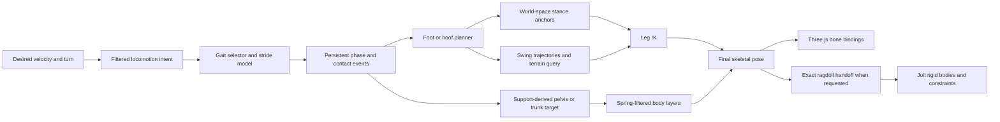

# Organic procedural locomotion for humanoids, horses, and mounted units

**Research date:** 2026-08-22

**Runtime scope:** `client/apps/game/src/three/characters`

**Evidence policy:** biomechanical claims below come from peer-reviewed experimental or modelling papers; animation
claims come from peer-reviewed graphics papers or official conference material; engine claims come from official
Three.js and Jolt documentation. Proposed tuning values are labelled as implementation starting points rather than
measured biological constants.

**Implementation status (2026-08-23):** humanoid walk/run now use distance-coupled phase, explicit contact cycles,
world-space plant anchors with an early-swing release, asymmetric swing timing, support-driven mode-specific pelvis
motion, layered torso/arm filtering, and moving-root gym evaluation. The original observations below preserve the
baseline that motivated the work. Horse/mounted moving-root proof, articulated humanoid foot roll, and additional
secondary layers remain open. Current measurements and promotion scores live in
[Animation evaluation](./animation-evaluation.md).

## Executive answer

The current robotic quality is **not mainly a bad-parameter problem**. It is a signal-design problem.

The existing humanoid pose is generated from one phase and several direct sine waves. Its ankles are the unconstrained
result of two rotating leg segments, its pelvis is corrected upward after the fact, and its arms, pelvis, chest, and
head respond with no temporal memory. The horse has better leg IK, but its body, neck, and tail are still sinusoidal;
stance targets are recomputed every frame instead of being planted in world space; terrain normals are returned but
ignored; and the mounted rider is rigidly copied onto the saddle. These facts are visible in
[`procedural-character-pose.ts`](../../client/apps/game/src/three/characters/procedural-character-pose.ts),
[`procedural-horse-gait.ts`](../../client/apps/game/src/three/characters/horse/procedural-horse-gait.ts),
[`procedural-horse-pose.ts`](../../client/apps/game/src/three/characters/horse/procedural-horse-pose.ts), and
[`procedural-unit-runtime.ts`](../../client/apps/game/src/three/characters/procedural-unit-runtime.ts).

The next pass should keep the existing skins, bone bindings, FABRIK solver, gym, shared Jolt world, and ragdoll handoff.
It should replace the stateless oscillators with a small **stateful locomotion controller**:

1. advance gait phase from distance and filtered speed;
2. emit explicit foot/hoof contact events;
3. capture world-space plant anchors and hold them throughout stance;
4. plan asymmetric swing trajectories to the next foothold;
5. derive pelvis/trunk motion from the active support pattern;
6. filter torso, head, arms, neck, tail, and rider through different response times;
7. add small seeded, band-limited stride variation only after contacts are correct.

This is still procedural animation. It is a modest runtime and pose-layer refactor, not a new model, authored animation
library, neural controller, or always-on physics simulation. Graphics work has repeatedly treated contact timing and
footprints as the organizing constraint for plausible locomotion, while phase-aware controllers remain effective for
interactive terrain-adaptive motion.
[Van de Panne, _From Footprints to Animation_, Computer Graphics Forum 1997](https://diglib.eg.org/items/836a144a-9219-440a-83bf-6aa32781546a),
[Kovar, Schreiner, and Gleicher, _Footskate Cleanup for Motion Capture Editing_, SCA 2002](https://pages.cs.wisc.edu/~kovar/footskateCleanup.pdf),
[Holden, Komura, and Saito, _Phase-Functioned Neural Networks for Character Control_, ACM TOG/SIGGRAPH 2017](https://www.ipab.inf.ed.ac.uk/cgvu/phasefunction.pdf)

Jolt should continue to own collision reactions and ragdolls, not ordinary gait synthesis. Jolt's virtual character is a
collision-driven root object, while constraint motors drive rigid bodies toward velocities or positions; neither is a
replacement for foot planning and skeletal posing.
[Jolt `CharacterVirtual`](https://jrouwe.github.io/JoltPhysics/class_character_virtual.html),
[Jolt constraints and motors](https://jrouwe.github.io/JoltPhysicsDocs/5.5.0/index.html)

## Why the present motion reads as robotic

### Humanoid baseline

[`resolveProceduralCharacterPose()`](../../client/apps/game/src/three/characters/procedural-character-pose.ts) currently
has these structural limitations:

- Phase is `elapsedSeconds × animationSpeed`, so it is not coupled to actor displacement.
- Left and right hip angles are pure antiphase sinusoids, and knee flexion is just the positive half of the same wave.
- Neither ankle has a persistent plant point. The code only moves the pelvis vertically until the lowest generated ankle
  touches a constant ground height.
- Pelvis sway, chest twist, torso roll, arms, and root bob are direct functions of the same phase. There is no loading,
  anticipation, impact absorption, lag, follow-through, or memory.
- Head orientation equals chest orientation, so the head amplifies torso motion instead of being stabilized.
- The rig has `foot_l` and `foot_r` bones, but the pose contract does not drive foot pitch or toe-off separately.
- Mounted mode is a fixed seated pose plus breathing; the unit runtime then copies the rider object's position and
  quaternion exactly from the saddle each frame.

These are repository observations, not judgements about the source asset. The current rig already exposes the joints
needed for a stronger procedural controller.

### Horse baseline

The horse implementation is closer to the right architecture because it already has gait profiles, per-hoof cycles,
terrain sampling, anatomical bend preservation, and FABRIK. Its remaining limitations are:

- A gait profile contains one duty factor for all four limbs and no left/right lead, although canter and gallop are
  asymmetric gaits with lead-specific footfall order and unequal limb use. Experimental horse gait data distinguish walk
  and trot as symmetric and canter and gallop as asymmetric; lead forelimbs are the last forelimbs to contact before
  aerial phase.
  [Robilliard, Pfau, and Wilson, _Gait characterisation and classification in horses_, JEB 2007](https://doi.org/10.1242/jeb.02611)
- The current walk offsets do not produce the measured lateral sequence, and the current trot offsets do not pair the
  diagonals. Measured footfall order is `LH, LF, RH, RF` at walk and `(LH + RF), (RH + LF)` at trot. Left-lead canter is
  `RH, RF at or before LH, LF`; left-lead transverse gallop is `RH, LH, RF, LF`; right leads mirror those orders.
  [Robilliard et al. 2007](https://doi.org/10.1242/jeb.02611)
- A stance hoof still sweeps from the front to the back of its stride every frame. That only looks planted when root
  motion happens to cancel it exactly; the gym and acceleration/deceleration expose the mismatch.
- Root height and body pitch are global sine waves. They do not know which hooves are supporting the animal.
- Every neck bone receives a weighted copy of one sine, and every tail bone receives a weighted copy of another. This
  creates a visibly mechanical travelling shape without inertia.
- The ground sample's normal is never consumed, and only the ground height at the instantaneous hoof target is sampled.
  Body attitude, hoof orientation, and obstacle clearance therefore do not adapt to the support surface.

## Target runtime architecture



The controller is a hybrid state machine: phase is continuous, while touchdown and lift-off are discrete events. This
matches the graphics literature's treatment of fixed footplant constraints and footprints, and it matches gait studies'
division of a stride into stance and swing. [Kovar et al. 2002](https://pages.cs.wisc.edu/~kovar/footskateCleanup.pdf),
[Umberger, _Stance and swing phase costs in human walking_, Journal of the Royal Society Interface 2010](https://doi.org/10.1098/rsif.2010.0084)

Each actor needs a small persistent state object. It should not be stored in React or RECS; it is transient renderer
state owned beside `phase` and `elapsedSeconds` in each runtime actor.

```ts
interface LocomotionState<FootId extends string> {
  phase: number;
  filteredSpeed: number;
  travelledDistance: number;
  strideIndex: number;
  feet: Record<
    FootId,
    {
      contact: "stance" | "swing";
      plantWorld: Vector3;
      swingStartWorld: Vector3;
      swingEndWorld: Vector3;
      previousTargetWorld: Vector3;
    }
  >;
  body: SpringPoseState;
  variation: SeededStrideVariation;
}
```

Three.js already supplies normalized quaternions, spherical interpolation, and frame-rate-independent scalar damping;
those are sufficient building blocks for pose filtering without introducing another runtime dependency.
[Three.js `Quaternion`](https://threejs.org/docs/pages/Quaternion.html),
[Three.js `MathUtils.damp`](https://threejs.org/docs/pages/MathUtils.html)

## Humanoid locomotion design

### 1. Contact timing and phase

At ordinary walking speed, one human foot is on the ground for a little over 60% of its stride and swings for a little
under 40%; the stance begins and ends with double support. [Umberger 2010](https://doi.org/10.1098/rsif.2010.0084)
Running uses a different contact regime with shorter stance and a flight interval rather than simply playing a walk wave
faster. [Novacheck, _The biomechanics of running_, Gait & Posture 1998](<https://doi.org/10.1016/S0966-6362(97)00038-6>)

Recommended starting profiles—not universal human constants—are:

| Mode | Left contact phase | Right contact phase | Duty factor | Controller meaning                           |
| ---- | -----------------: | ------------------: | ----------: | -------------------------------------------- |
| walk |             `0.00` |              `0.50` |      `0.62` | two approximately 12%-stride overlap windows |
| run  |             `0.00` |              `0.50` |      `0.42` | two approximately 8%-stride flight windows   |

Advance phase from distance, not only time:

```text
strideLength = resolveStrideLength(filteredSpeed, morphology, style)
cycleRate    = filteredSpeed / max(strideLength, epsilon)
phase        = wrap01(phase + cycleRate * dt)
```

When the gym previews an in-place actor, substitute `desiredSpeed × dt` for measured displacement. During gameplay,
blend desired travel with clamped actual root displacement so network interpolation does not create a single giant phase
jump. Humans can vary both stride frequency and stride length at a fixed velocity, but the available range narrows as
speed rises; that supports treating stride length and cadence as coupled outputs rather than independent sliders.
[Nilsson and Thorstensson, _Adaptability in frequency and amplitude of leg movements during human locomotion at different speeds_, Acta Physiologica Scandinavica 1987](https://doi.org/10.1111/j.1748-1716.1987.tb08045.x)

Filter speed before resolving gait, cadence, and stride. Use hysteresis around walk/run thresholds, then preserve the
current plant until its next legal lift-off. Smooth pose discontinuities with inertialization rather than resetting the
phase or blending two complete controllers; Microsoft's official GDC presentation describes inertialization as a
post-process for vector and quaternion transition offsets.
[Bollo, _Inertialization: High-Performance Animation Transitions in Gears of War_, GDC 2018](https://www.gdcvault.com/play/1025165/Inertialization)

### 2. True foot locking

Real footplants are intervals in which the planted part of the foot stays fixed relative to the ground, and even small
foot movement during that interval is a strong realism failure.
[Kovar et al. 2002](https://pages.cs.wisc.edu/~kovar/footskateCleanup.pdf)

On a `swing → stance` event:

1. project the planned landing onto the terrain;
2. save that point as `plantWorld`;
3. keep the ankle target at exactly that world point throughout stance;
4. convert the anchor into actor-local space only immediately before IK;
5. fade IK weight in and out around contact, but never slide the anchor itself.

Use a proposed `plantBlendFraction` of `0.04–0.07` of a stride. This range is an art-tuning start; its purpose is to
avoid an angular snap while preserving the hard positional constraint.

The current rig can gain most of the benefit by locking the ankle endpoint already used to build `thigh` and `shin`
poses. A later refinement should bind `foot_l` and `foot_r` explicitly so the controller can roll heel-to-toe during
stance and dorsiflex the toes during swing. `SkinnedMesh` is designed to deform through skeleton bone transforms and
skin weights, so this remains ordinary Three.js skeletal animation.
[Three.js `SkinnedMesh`](https://threejs.org/docs/pages/SkinnedMesh.html)

### 3. Swing-foot trajectory

A symmetric half-sine gives equal time and shape to lift-off and landing, which looks mechanical. Human toe clearance
has a local minimum around mid-swing, close to peak forward foot speed, and subjects raise clearance and subtly change
ankle, knee, and hip flexion when the surface is irregular.
[Schulz, _Minimum toe clearance adaptations to floor surface irregularity and gait speed_, Journal of Biomechanics 2011](https://doi.org/10.1016/j.jbiomech.2011.02.010)

Use separate horizontal, vertical, and rotational curves:

```text
q       = quinticSmoothstep(swingProgress)       // zero endpoint velocity
xz      = hermite(swingStart, swingEnd, q)
ankleY  = groundLerp + skewedBump(progress) * clearance
footRot = slerp(toeOffPitch, heelStrikePitch, q)
```

Recommended first-pass curve controls—not measured constants—are:

- ankle apex at `0.40–0.46` of swing rather than exactly `0.50`;
- faster forward acceleration in early swing and a longer deceleration into contact;
- a small toe-up interval around mid-swing;
- a small heel-down landing angle for walk, approaching flatter contact as speed rises;
- clearance derived from leg length, speed, and the highest sampled point along the swing corridor.

Do not add random noise directly to the planted foot or swing endpoint. Variability belongs in the next planned
footprint, stride duration, and style targets.

### 4. Pelvis and center-of-mass motion

Human walking has one complete vertical body-center-of-mass cycle per step—two per stride—and the freely selected adult
walking excursion is commonly around 4–5 cm. The sacrum is only an approximation and overestimates center-of-mass
excursion at faster speeds, so root bob should be treated as a stylized support response, not literal pelvis-marker
motion.
[Gard, Miff, and Kuo, _Comparison of kinematic and kinetic methods for computing the vertical motion of the body center of mass during walking_, Human Movement Science 2004](https://doi.org/10.1016/j.humov.2003.11.002)

Derive the pelvis from support rather than `abs(sin(phase))`:

- In walking, raise the root through single-support midstance and lower it during double support.
- Shift lateral weight toward the stance foot before the opposite foot leaves the ground.
- Add pelvic yaw with stride length; at faster walking speeds, pelvic rotation contributes to step length while the
  thorax increasingly counter-rotates.
  [Bruijn et al., _Coordination of leg swing, thorax rotations, and pelvis rotations during gait_, Gait & Posture 2008](https://doi.org/10.1016/j.gaitpost.2007.05.017)
- In running, compress the root during stance and let it rise into flight rather than reusing the walking shape.
  [Novacheck 1998](<https://doi.org/10.1016/S0966-6362(97)00038-6>)

The support centroid should set the low-frequency pelvis target. A critically damped spring should absorb sharp changes,
while an IK reach check may raise the root if a planted target would overextend a leg. The plant anchor must win over
the decorative bob signal.

### 5. Torso, head, and arms

Pelvis-thorax relative phase changes continuously from more in-phase at low walking speeds to more out-of-phase at
higher speeds. A seven-subject treadmill study measured a shift from roughly 25° to 110° as velocity increased, so one
fixed `-sin(phase)` torso relationship cannot cover the speed range.
[van Emmerik and Wagenaar, _Effects of walking velocity on relative phase dynamics in the trunk in human walking_, Journal of Biomechanics 1996](<https://doi.org/10.1016/0021-9290(95)00128-X>)

Arm swing is approximately opposite the leg pattern and is not cosmetic noise: experimentally suppressing normal arm
swing increased the vertical ground-reaction moment and metabolic cost, while a passive-dynamic model produced
human-like swing with little shoulder torque.
[Collins, Adamczyk, and Kuo, _Dynamic arm swinging in human walking_, Proceedings of the Royal Society B 2009](https://doi.org/10.1098/rspb.2009.0664)

Recommended procedural layering:

- pelvis yaw follows the stride target;
- chest yaw follows a speed-dependent counter-rotation target through a spring;
- shoulders target the opposite leg but behave as damped pendulums, not exact phase copies;
- elbows flex more during backward recovery and running, with their own slightly slower response;
- weapon mass lowers arm response frequency and amplitude on that side;
- the head applies partial inverse chest pitch/roll/yaw and a slower look target.

Humans stabilize head orientation around the earth-horizontal reference across walking, running-in-place, hopping, and
other locomotor tasks despite large differences in translation.
[Pozzo, Berthoz, and Lefort, _Head stabilization during various locomotor tasks in humans. I. Normal subjects_, Experimental Brain Research 1990](https://pubmed.ncbi.nlm.nih.gov/2257917/)

Suggested response values for gym tuning, not biomechanical measurements:

| Layer              | Natural frequency | Damping ratio | Practical effect                   |
| ------------------ | ----------------: | ------------: | ---------------------------------- |
| pelvis translation |         `7–10 Hz` |     `0.9–1.0` | firm support without snapping      |
| chest rotation     |          `4–6 Hz` |     `0.8–1.0` | visible counter-motion             |
| shoulder           |          `3–5 Hz` |   `0.65–0.85` | pendular overlap                   |
| forearm/weapon     |        `2.5–4 Hz` |    `0.55–0.8` | mass-dependent follow-through      |
| head stabilization |          `5–8 Hz` |     `0.9–1.0` | steady gaze, small residual motion |

For a simple first implementation, frame-rate-independent `MathUtils.damp()` and quaternion `slerp()` are sufficient. If
overshoot is desired for arms and equipment, keep velocity and integrate a second-order spring.

### 6. Controlled variability

Healthy self-paced walking does vary from stride to stride, but the variation is not independent white noise; stride
intervals exhibit long-range correlations extending across many steps.
[Hausdorff et al., _Is walking a random walk?_, Journal of Applied Physiology 1995](https://doi.org/10.1152/jappl.1995.78.1.349)

Use three levels of deterministic variation:

1. **Actor identity:** permanent seeded differences in preferred cadence, stride, posture, and arm amplitude.
2. **Stride variation:** a slowly evolving correlated signal sampled only when `strideIndex` advances.
3. **Micro-motion:** very low-amplitude breathing, cloth, ears, and tail signals that never move a contact anchor.

Approximate correlated variability with two or three low-frequency seeded noise octaves or a damped autoregressive
signal. Do not call `Math.random()` per frame. Proposed starting amplitudes are cadence `±1.5%`, planned step length
`±2%`, body lean `±0.5°`, and arm target phase `±1%` of a stride. These are deliberately conservative art values, not
reported population statistics.

## Horse locomotion design

### 1. Replace phase offsets with explicit contact events

The gait definition should express what the animator means:

```ts
interface HorseGaitProfile {
  contactPhase: Record<HorseHoofId, number>;
  dutyFactor: Record<HorseHoofId, number>;
  dynamics: "stand" | "inverted-pendulum" | "spring" | "asymmetric-run";
  lead?: "left" | "right";
  strideLength: number;
}
```

The current implementation stores additive phase offsets. Because contact begins when
`wrap(masterPhase + offset) === 0`, an intended contact phase `c` must currently be encoded as `wrap(-c)`. That
inversion makes footfall tables easy to author incorrectly. Store contact phases directly and derive local progress in
one helper.

Recommended starting contact phases are below. The ordering comes from measured gait definitions; the exact normalized
spacing is proposed for art tuning and should be exposed in the gym. `HL/HR` mean hind left/right and `FL/FR` mean front
left/right.

| Gait         | Starting contact phases              |              Starting duty | Expected support pattern              |
| ------------ | ------------------------------------ | -------------------------: | ------------------------------------- |
| walk         | `HL 0.00, FL 0.25, HR 0.50, FR 0.75` |                     `0.61` | regular four-beat, no aerial phase    |
| trot         | `HL 0.00, FR 0.01, HR 0.50, FL 0.51` |                     `0.44` | diagonal beats with short suspension  |
| left canter  | `HR 0.00, FR 0.24, HL 0.27, FL 0.55` |     per-hoof around `0.39` | three-beat tendency plus aerial phase |
| right canter | mirror left                          |     per-hoof around `0.39` | mirrored lead                         |
| left gallop  | `HR 0.00, HL 0.20, FR 0.40, FL 0.60` | speed-scaled `0.36 → 0.30` | four distinct beats plus aerial phase |
| right gallop | mirror left                          | speed-scaled `0.36 → 0.30` | mirrored lead                         |

An IMU study of 1966 walk, 1932 trot, and roughly 1000 canter strides measured mean duty factors of 60.6%, 44.2%, and
about 39–40%, respectively.
[Serra Bragança et al., _Improving gait classification in horses by using IMU generated data and machine learning_, Scientific Reports 2020](https://pmc.ncbi.nlm.nih.gov/articles/PMC7576586/)
Robilliard et al.'s over-ground tables show gallop duty decreasing with speed and lead/trailing stance differences; they
also measured stride frequency increasing with speed. [Robilliard et al. 2007](https://doi.org/10.1242/jeb.02611)

Do not force perfect synchrony at trot. Make `diagonalDissociation` a small signed parameter, seeded per horse and
adjustable around zero. Keep it bounded so the gait still reads as diagonal; symmetric-gait contact ratios clustered
around 0.5 with small standard deviations in the over-ground study.
[Robilliard et al. 2007](https://doi.org/10.1242/jeb.02611)

Lead is semantic state, not random jitter. Preserve a chosen canter/gallop lead for multiple strides, switch it during a
safe transition, and mirror the entire contact table. Canter and gallop use measurably different left/right timing and
leading/trailing stance durations. [Robilliard et al. 2007](https://doi.org/10.1242/jeb.02611)

### 2. Plant hooves and plan the next foothold

Use the same event contract as the humanoid:

- On touchdown, capture the hoof's world-space point and terrain normal.
- During stance, return that exact point; do not recompute it from current root phase.
- During swing, plan a future landing from velocity, turn curvature, gait, and the neutral bind position.
- Replan early in swing as velocity changes, then freeze the endpoint during the final part of swing to prevent a target
  snap at contact.
- Run the existing FABRIK chain from current body attachment to that target.

The current `solveFabrikChain()` and preferred bend-hemisphere enforcement are reusable. The systemic change belongs in
the target planner and runtime state, not inside FABRIK.

Horse hoof flight should also be asymmetric. High-speed cinematography found the toe's flight arc reached its maximum
shortly after lift-off and then followed a relatively low path, which argues against a centered half-sine.
[Clayton, _The effect of an acute hoof wall angulation on the stride kinematics of trotting horses_, Equine Veterinary Journal 1990](https://doi.org/10.1111/j.2042-3306.1990.tb04742.x)

Suggested hoof swing controls, explicitly art-tuning starts:

- apex at `0.28–0.38` of swing;
- fast breakover and lift, broad low protraction, then a controlled descent;
- toe-up rotation after lift-off, approaching terrain-normal alignment before touchdown;
- front and hind clearance scales tuned independently;
- clearance measured against several samples along the swing corridor, not just the landing point.

### 3. Make body motion a result of support

At walk, horse withers and croup use inverted-pendulum mechanics: each is low around hoof-on, rises through midstance,
and descends toward lift-off. Withers and croup rise and fall alternately, while vertical head motion is out of phase
with the withers and in phase with the croup. At trot, the body behaves more like a spring-mass pattern: head, withers,
and croup descend during diagonal stance and rise toward push-off/suspension, twice per stride.
[Rhodin et al., _Timing of Vertical Head, Withers and Pelvis Movements Relative to the Footfalls in Different Equine Gaits and Breeds_, Animals 2022](https://pmc.ncbi.nlm.nih.gov/articles/PMC9657284/)

Implement gait-specific support functions:

```text
walk:
  frontHeight = invertedPendulumArc(activeForeStanceProgress)
  hindHeight  = invertedPendulumArc(activeHindStanceProgress)
  bodyY       = weightedMean(frontHeight, hindHeight)
  bodyPitch   = atan2(frontHeight - hindHeight, bodyLength)

trot:
  compression = sum(smoothContactLoad(each stance hoof))
  bodyY       = baseY - compression * trotCompression + flightLift

canter/gallop:
  bodyY, pitch = filtered sum of lead-aware contact and push-off envelopes
```

Galloping racehorses do not fit a simple classical spring-mass model: measured mechanical-energy changes were dominated
by forward kinetic-energy fluctuations and potential-energy fluctuation was comparatively small. Therefore gallop should
use a sequence of support impulses and pitch changes, not merely a larger vertical sine.
[Pfau, Witte, and Wilson, _Centre of mass movement and mechanical energy fluctuation during gallop locomotion in the Thoroughbred racehorse_, JEB 2006](https://doi.org/10.1242/jeb.02439)

Compute a target body pose from support, then damp it. Never feed decorative body motion back into the fixed plant
anchors; IK should absorb the body motion subject to reach limits.

### 4. Neck, head, spine, and tail

Horse head and neck movement is gait-specific rather than one wave with a different amplitude. In over-ground trials,
walk used large, opposite head and neck rotations relative to the trunk; trot coupled neck and trunk more closely while
the head bobbed slightly and rapidly; canter produced a third distinct pattern.
[Dunbar et al., _Stabilization and mobility of the head, neck and trunk in horses during overground locomotion_, JEB 2008](https://doi.org/10.1242/jeb.020578)

At walk, the phase of head-neck movement relative to the withers is also consistent with reducing the cost of carrying
the head-neck mass; a model driven by measured horse kinematics found higher predicted cost when that timing was
changed.
[Loscher et al., _Timing of head movements is consistent with energy minimization in walking ungulates_, Proceedings of the Royal Society B 2016](https://doi.org/10.1098/rspb.2016.1908)

Replace the current shared `neckWave` with a target at the head plus a spring chain:

1. generate a gait-specific head target from support events;
2. apply turn/look offsets at the head;
3. solve or distribute the rotation from neck base to poll;
4. give distal neck bones slightly lower frequency or greater phase delay;
5. cap per-joint rotation and preserve the authored bind curve.

The spine should receive small distributed pitch, lateral bend, and axial rotation rather than one rigid body rotation.
In a five-horse canter study, vertebral rotations were coupled to limb protraction/retraction; measured whole-region
ranges were larger for flexion-extension than lateral bending or axial rotation.
[Faber et al., _Three-dimensional kinematics of the equine spine during canter_, Equine Veterinary Journal 2001](https://doi.org/10.1111/j.2042-3306.2001.tb05378.x)

Tail motion can remain an art-directed secondary layer. Drive its base from pelvis angular velocity and acceleration,
then propagate a damped response down the chain. Add only slow seeded wind/idle noise; do not phase-lock every tail bone
to hoof cadence.

### 5. Turns and terrain

For every planned landing, query:

- landing height and normal;
- the highest height along 4–6 swing-corridor samples;
- support-plane height and normal from currently planted hooves;
- whether the leg can reach without violating its preferred bend hemisphere.

Align the hoof's up axis toward the landing normal with an angular clamp, while preserving travel-direction yaw. Build a
best-fit support plane from planted hooves and damp body pitch/roll toward it. Use a proposed `0.12–0.25 s`
body-attitude half-life so rough terrain moves the legs first and the trunk second.

Incline is not only a body-tilt parameter. In six trained horses trotting at 4 m/s, a 6% incline increased stance
duration, especially in the hindlimbs, and changed hindlimb joint range and propulsion.
[Sloet van Oldruitenborgh-Oosterbaan, Barneveld, and Schamhardt, _Effects of treadmill inclination on kinematics of the trot in Dutch Warmblood horses_, Equine Veterinary Journal 1997](https://doi.org/10.1111/j.2042-3306.1997.tb05058.x)

Recommended terrain adaptations are therefore:

- raise duty factor modestly and reduce preferred speed on a sustained incline;
- allow more hindlimb placement under the body uphill;
- bias body pitch from the filtered support plane, not the instantaneous sample under one hoof;
- increase swing clearance from the path maximum on steps and waves;
- preserve world-space stance anchors even while body attitude changes.

### 6. Mounted rider coupling

The current mounted runtime rigidly copies the saddle quaternion into the rider root. Real rider motion is coupled but
articulated. At walk on a circle, rider pelvis roll completed one cycle per stride in phase with the horse trunk, while
pelvic pitch amplitude and timing varied between riders and conditions.
[Egenvall et al., _Roll and Pitch of the Rider's Pelvis During Horseback Riding at Walk on a Circle_, Journal of Equine Veterinary Science 2022](https://doi.org/10.1016/j.jevs.2021.103798)

Use the saddle pose as an input, not the rider's final pose:

- pelvis position follows saddle translation tightly;
- pelvis roll/yaw follows most of saddle motion through a short spring;
- pelvis pitch adds a gait-specific seated response rather than copying body pitch one-to-one;
- chest partially counter-rotates and lags the pelvis;
- head applies the same stabilization layer as a walking humanoid;
- hands target rein/weapon sockets with arm IK, allowing elbows to absorb relative motion;
- legs retain stirrup/knee targets instead of remaining a frozen seated shape.

This change should live in `MountedUnitActor` state or a small `MountedRiderController`, not in the horse pose resolver.
It preserves reuse of the same horse and humanoid actors.

## Parameters to add to the gym

These ranges are proposed control surfaces for art direction. They are not claimed as population-normal biomechanics.

### Humanoid controls

| Group     | Parameter                                | Proposed initial/default range    |
| --------- | ---------------------------------------- | --------------------------------- |
| timing    | `walkDutyFactor`                         | default `0.62`, range `0.56–0.68` |
| timing    | `runDutyFactor`                          | default `0.42`, range `0.32–0.49` |
| timing    | `speedResponse`                          | `3–10 s⁻¹`                        |
| stride    | `preferredStrideScale`                   | `0.75–1.25`                       |
| plant     | `plantBlendFraction`                     | `0.03–0.09`                       |
| swing     | `swingApexPhase`                         | `0.35–0.52`                       |
| swing     | `toeOffPitch`, `landingPitch`            | `-20°…20°` bounded by mode        |
| balance   | `weightShift`, `pelvisYaw`, `pelvisList` | normalized art amplitudes         |
| body      | `chestCounterRotation`                   | `0–1.5` multiplier                |
| body      | `headStabilization`                      | `0–1`                             |
| secondary | `armSpring`, `weaponLag`                 | frequency/damping pairs           |
| variation | `strideVariation`, `postureVariation`    | `0–0.04` normalized               |

Existing `stride`, `stepHeight`, `armSwing`, `hipSway`, `torsoTwist`, `bob`, and `lean` can remain as high-level style
multipliers. They should multiply controller outputs rather than directly defining sine amplitudes.

### Horse controls

| Group     | Parameter                                    | Proposed initial/default range                           |
| --------- | -------------------------------------------- | -------------------------------------------------------- | ------ |
| gait      | `lead`                                       | `left                                                    | right` |
| gait      | `diagonalDissociation`                       | `-0.04…0.04` stride                                      |
| timing    | per-gait duty                                | walk/trot/canter/gallop profiles plus `dutyFactorOffset` |
| swing     | `frontApexPhase`, `hindApexPhase`            | `0.22–0.45`                                              |
| swing     | `landingFreezeFraction`                      | `0.15–0.35` of swing                                     |
| support   | `walkVault`, `trotCompression`, `flightLift` | rig-scaled amplitudes                                    |
| axial     | `spineFlex`, `neckLag`, `headNod`            | gait-specific multipliers                                |
| terrain   | `bodyTerrainResponse`, `hoofNormalWeight`    | `0–1`                                                    |
| variation | `strideVariation`, `dissociationVariation`   | conservative seeded values                               |

The gym should also visualize contact bars, plant anchors, planned landing points, support polygon/plane, swing
corridor, and per-leg reach error. Those diagnostics will make bad motion attributable instead of subjective.

## Clean implementation sequence

### Stage 1: shared contact-state primitives

Add a small renderer-local module for phase wrapping, contact crossing, seeded correlated stride values, spring state,
and world/local plant conversion. Keep it free of species-specific bone names.

Acceptance gates:

- phase is finite and deterministic under variable `dt`;
- each contact event fires exactly once when phase wraps;
- reset reproduces the same seeded sequence;
- no allocation is required inside the per-frame contact loop.

### Stage 2: humanoid feet first

Move phase ownership from the pure pose function into `RuntimeProceduralCharacterActor`. Add two foot states, planned
ankle targets, and two-bone leg IK. Preserve the existing pose contract and bone bindings initially; add explicit foot
rotation only after ankle locking is stable.

Acceptance gates:

- stance ankle world drift below `0.5%` of leg length, with a stretch goal of `1 mm` at hero scale;
- no knee flips across the full stride/step-height gym range;
- phase tracks distance during acceleration and deceleration;
- walk contains double support and run contains flight at their defaults.

### Stage 3: humanoid body layers

Replace direct pelvis/chest/head/arm sinusoids with support targets and filtered layer states. Add speed-dependent
pelvis-thorax phase, head stabilization, and mass-aware weapon lag.

Acceptance gates:

- head world pitch/roll amplitude is lower than chest amplitude when stabilization is enabled;
- arm and chest curves remain continuous through walk/run transitions;
- a planted foot remains fixed while root, pelvis, and chest respond.

### Stage 4: correct horse event tables

Change `HorseGaitDefinition` to direct contact phases, per-hoof duty factors, and lead. Add sequence/support tests
before changing visual curves.

Acceptance gates:

- walk order is `HL → FL → HR → FR` and never aerial at defaults;
- trot contacts diagonal pairs and has two suspension intervals at defaults;
- left/right canter and gallop mirror exactly;
- canter reads as three-beat-capable and gallop as four-beat with an aerial interval;
- duty decreases as configured speed rises.

### Stage 5: horse plants, support motion, and terrain

Give every horse actor persistent hoof state. Reuse FABRIK, replace moving stance targets, derive body pose from
support, and consume terrain normals/corridor samples.

Acceptance gates:

- all stance hooves hold their world anchors on flat, slope, wave, and step courses;
- body pitch/roll remains continuous when a hoof changes support;
- every swing clears the sampled corridor plus configured margin;
- hoof up vectors approach ground normal without exceeding angular limits;
- bend-alignment smoke metrics remain green.

### Stage 6: neck, spine, tail, and rider overlap

Add filtered axial chains and replace rigid saddle copying with layered rider coupling. This is the final organic-motion
pass because secondary motion cannot hide incorrect contacts.

Acceptance gates:

- horse walk head motion is opposite withers motion; trot axial segments rise/fall together;
- neck and tail bone rotations have progressive phase/response rather than identical wave timing;
- mounted pelvis follows saddle while chest/head exhibit bounded relative motion;
- ragdoll creation still seeds from the exact visible pose.

## Verification and benchmark plan

### Deterministic automated tests

- Unit-test every contact table over two complete cycles with coarse and irregular `dt`.
- Property-test contact counts, ordering, support count, and aerial intervals.
- Test world-space plant invariance while translating and rotating the actor root.
- Test swing endpoints and first derivatives at lift-off/touchdown.
- Test terrain normals, unreachable targets, steep steps, and bend-hemisphere preservation.
- Test spring/filter results across 30, 60, and 120 Hz within a defined tolerance.
- Test that identical seeds reproduce variation and different seeds remain within configured bounds.
- Test animated-to-ragdoll handoff after touchdown, mid-swing, flight, and a mounted canter pose.

### Gym scenarios

1. **Contact treadmill:** side view, root speed ruler, plant trails, contact chart.
2. **Acceleration lane:** idle → walk → run → walk → stop without phase reset.
3. **Uneven corridor:** slope, waves, isolated step, alternating cross-slope.
4. **Horse gait wall:** walk/trot/left-right canter/left-right gallop synchronized for comparison.
5. **Mounted coupling:** rigid reference ghost beside the filtered rider.
6. **Variation grid:** 25 identical recipes with different seeds; contacts must remain correct.
7. **Ragdoll handoff:** strike at selectable gait phase and confirm no visible teleport.

### Quantitative diagnostics

Record these in the existing smoke/benchmark payload:

- maximum stance-foot/hoof world drift;
- maximum swing penetration below sampled terrain;
- contact order and support count histogram;
- maximum IK reach error and minimum bend alignment;
- root acceleration and angular-velocity spikes at contact transitions;
- head-to-chest angular amplitude ratio;
- mounted pelvis-to-saddle and chest-to-pelvis lag;
- CPU animation time per 25/50/100 actors;
- allocations per frame and unchanged Jolt body/constraint counts while actors are animated.

## What not to do

- Do not try to fix the gait by adding more uncorrelated noise. Healthy stride variation is temporally structured, and
  noise on contact targets creates foot skate. [Hausdorff et al. 1995](https://doi.org/10.1152/jappl.1995.78.1.349),
  [Kovar et al. 2002](https://pages.cs.wisc.edu/~kovar/footskateCleanup.pdf)
- Do not run a dynamic Jolt ragdoll underneath every normally animated unit. Keep the exact existing promotion/handoff
  boundary; Jolt motors are an optional future powered-ragdoll layer, not a prerequisite for organic gait.
  [Jolt constraints and motors](https://jrouwe.github.io/JoltPhysicsDocs/5.5.0/index.html)
- Do not tune upper-body polish before footfall sequence and plant locking. Contacts are the primary visual contract
  with the world. [Van de Panne 1997](https://diglib.eg.org/items/836a144a-9219-440a-83bf-6aa32781546a),
  [Kovar et al. 2002](https://pages.cs.wisc.edu/~kovar/footskateCleanup.pdf)
- Do not make every layer an exact function of the same phase. Speed-dependent coordination, head stabilization,
  lead-specific asymmetry, and rider articulation all require distinct targets or response times.
  [van Emmerik and Wagenaar 1996](<https://doi.org/10.1016/0021-9290(95)00128-X>),
  [Dunbar et al. 2008](https://doi.org/10.1242/jeb.020578),
  [Egenvall et al. 2022](https://doi.org/10.1016/j.jevs.2021.103798)

## Decision

Implement the next animation pass as **contact-driven procedural locomotion with layered springs**. Keep Jolt at the
ragdoll/reaction boundary and keep the current skinned assets. Correct the horse footfall tables first, then add
world-space plants, support-derived body motion, and secondary overlap. Parameters still matter, but they should tune a
biomechanically coherent controller rather than compensate for one shared sine oscillator.
