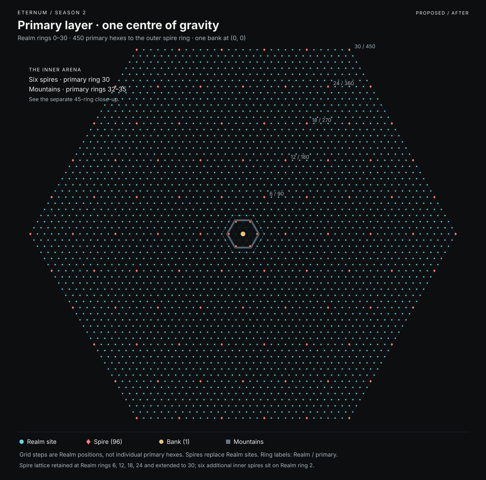
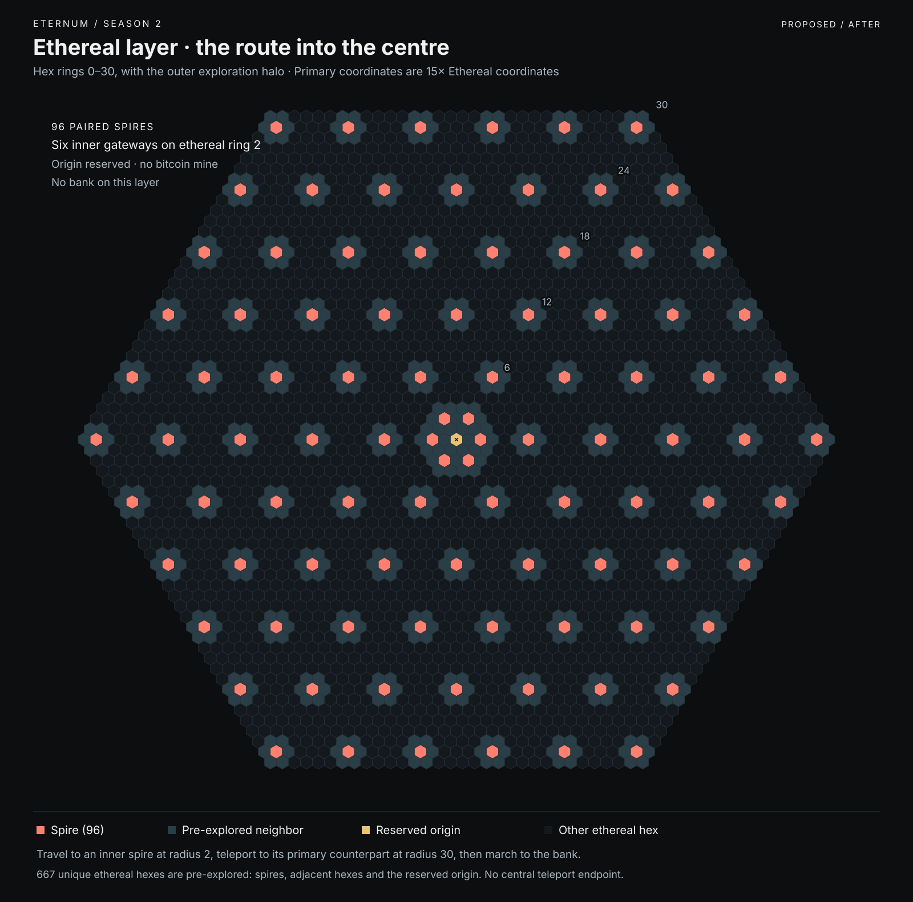
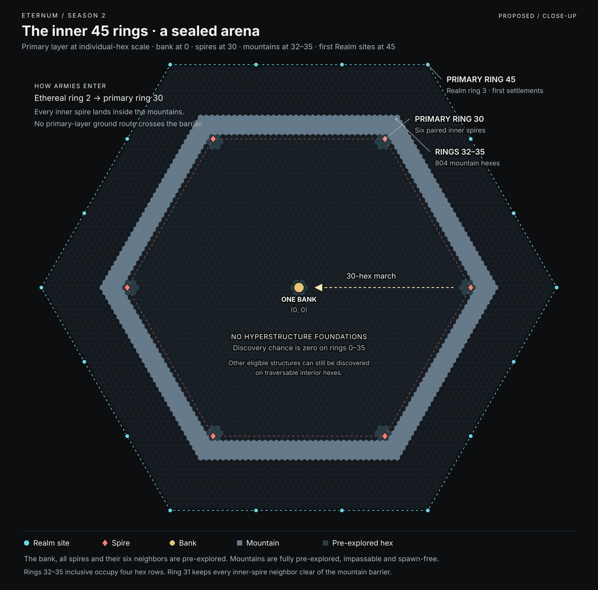

# One Bank at the centre

Eternum S2 concentrates its banking contest at a single World Bank on the Primary layer's origin, `(0,0)`. Every Realm
and Village routes its AMM swaps and orderbook trades through this Bank. The six regional Banks are removed. The Bank
controller receives the existing controller fee across that eligible trade, giving the whole map one economic objective
to contest.

Reaching it is a military operation. An unbroken mountain range surrounds the centre. Armies must enter the Ethereal
layer through an outer Spire, fight or travel inward, cross back through one of six inner Spires, then march toward the
Bank. Those inner Spires are 30 Primary hexes from the centre. Capturing a Bank therefore depends on controlling an
approach, supplying an expedition and holding the centre against rivals arriving from six directions.

## 1. What changes, and why

| Mechanic                   | Previous layout in the supplied maps                   | Central Bank design                                           |
| -------------------------- | ------------------------------------------------------ | ------------------------------------------------------------- |
| Banking                    | Six Banks at the corners of Realm ring 21              | One Bank at Primary `(0,0)`                                   |
| Fee rights                 | Eligible trading revenue divided among six controllers | One controller receives the Bank controller fee stream        |
| Centre                     | A Spire connects both origins                          | Bank on Primary; vacant, explored origin on Ethereal          |
| Inner access               | No ring-2 Spires                                       | Six paired Spires: Primary radius 30 / Ethereal radius 2      |
| Outer Spires               | Six-spaced lattice through Realm ring 24               | Lattice retained and extended through Realm ring 30           |
| Primary approach           | Armies can traverse the centre over land               | Full mountain barrier at Primary radii 32–35                  |
| Hyperstructure Foundations | Centre-weighted discovery                              | Same calculation outside radius 35; zero chance at radii 0–35 |
| First Realm placements     | Realm ring 3                                           | Realm ring 3, Primary radius 45, outside the mountains        |

Concentration increases the potential reward for control; it does not guarantee six times the income. With equal trade
volume across the old Banks, one old controller earned one-sixth of the controller fees. The new holder receives all of
that eligible fee stream, assuming the same world trading volume. Actual income still depends on trade, fees and time in
control.

The selected AMM controller fee remains 250 basis points (2.5% of LORDS notional), alongside the existing
250-basis-point protocol fee. A hypothetical 100,000 LORDS of eligible AMM volume therefore produces 2,500 LORDS in
controller fees at the central Bank. This example does not set orderbook fees or create a second fee when a trade
settles.

Global AMM liquidity remains global per ordinary resource. Moving Bank control does not multiply, reseed or redistribute
liquidity. Capture transfers future control and fee rights under the existing rules; it does not confiscate historical
wallet balances. The Bank retains its three T2 guard armies, one per troop class.

## 2. Read the maps in the right units

A **hex ring** contains all hexes at a particular hex distance from the origin. A **Realm ring** counts steps in the
wider Realm placement lattice. One Realm step spans 15 Primary hexes. A corresponding step in the Ethereal layer spans
one hex.

| Landmark                  | Realm ring | Primary hex radius | Ethereal hex radius |
| ------------------------- | ---------: | -----------------: | ------------------: |
| Bank / vacant counterpart |          0 |                  0 |                   0 |
| Inner Spires              |          2 |                 30 |                   2 |
| First Realm placements    |          3 |                 45 |  No Ethereal Realms |
| Outer Spire lattice       |          6 |                 90 |                   6 |
| Outer Spire lattice       |         12 |                180 |                  12 |
| Outer Spire lattice       |         18 |                270 |                  18 |
| Outer Spire lattice       |         24 |                360 |                  24 |
| New outer Spire lattice   |         30 |                450 |                  30 |

Spires at the outer rings include the intermediate six-step positions along each ring edge. The resulting rings contain
6, 12, 18, 24 and 30 Spires. Together with the six inner Spires, there are 96 paired Spire locations. There is no Spire
at either origin.

For signed axial hex coordinates `(q,r)`, radius is `max(abs(q), abs(r), abs(q+r))`. The six inner Ethereal Spires are
`(2,0)`, `(0,2)`, `(-2,2)`, `(-2,0)`, `(0,-2)` and `(2,-2)`. Their Primary counterparts multiply both coordinates by 15.
These are logical hex coordinates; client or contract storage offsets must be decoded before measuring distance.

The layer relationship identifies paired Spires. It is not permission to teleport from an arbitrary Primary coordinate
to its scaled Ethereal position.

## 3. Primary map: a single objective



The large map uses Realm placement spacing so the whole Spire network remains readable. Cyan markers denote eligible
Realm lattice positions, rather than guaranteed occupied Realms. Spire locations take precedence over Realm placement.
Rings 1 and 2 contain no Realm placements. The six former Bank sites return to normal placement eligibility under the
new layout.

The mountain range is small at this scale. The close-up below shows the actual Primary hexes, including the space
between the inner Spires, the mountains and the nearest Realm placements.

## 4. Ethereal map: the route inward



The Ethereal layer has no matching mountain wall. An army can travel across it toward a ring-2 Spire. That Spire returns
the army to its fixed counterpart at Primary radius 30, inside the mountain barrier. The origin remains an ordinary
explored Ethereal hex with no Spire, Bank or Bitcoin Mine.

Spire centres and each of their six neighbouring hexes begin explored. The origin is also explored and explicitly
excluded from Bitcoin Mine spawning. Exploration state alone must not be used as a substitute for that exclusion:
initialisation, later discovery and any administrative placement must all respect the reserved origin.

Extending the Spire lattice to radius 30 does not by itself change Bitcoin Mine probabilities. The selected Bitcoin
discovery core remains radius 24, with the existing decay through radius 36 and zero chance from radius 37. The map
shows transport coverage, not a new mining probability curve. Hexes pre-explored for Spire access never run a discovery
lottery as part of revealing them.

## 5. Close-up: the innermost 45 Primary rings



Read outward from the Bank:

- **Radius 0:** the Bank marks the centre.
- **Radii 1–29:** ordinary Primary terrain and potential conflict; eligible unexplored hexes can reveal Camps, Essence
  Rifts or Fragment Mines.
- **Radius 30:** six inner Spires form the gateways from Ethereal space.
- **Radius 31:** ordinary terrain includes the outward neighbours of the inner Spires. Their complete explored halos fit
  inside the mountain wall.
- **Radii 32–35:** every hex is Mountains. The barrier has no pass, portal, settlement or spawn location.
- **Radii 36–44:** ordinary terrain outside the wall. Hyperstructure Foundation discovery becomes eligible again,
  subject to the existing calculation and all other eligibility rules.
- **Radius 45:** Realm ring 3 is the first Realm placement ring.

The exact interval 32–35 is inclusive: **four hex rings**, containing 804 mountain hexes. Radius 31 is the last
non-mountain ring inside; radius 36 is the first non-mountain ring outside. No connected Primary movement path can cross
this complete annulus.

The 30-hex final approach is the distance between the inner Spire centre and the Bank centre. It is not a fixed arrival
time, stamina cost or mandatory count of move transactions. Actual actions depend on the normal crossing placement,
movement, attack range, terrain and combat rules. A path beginning on a neighbouring arrival hex can differ from the
centre-to-centre distance.

## 6. An expedition to the Bank

1. Prepare an army and the resources needed for the existing travel and combat rules.
2. Reach an outer Primary Spire, for example on radius 90. Resolve any defence or access requirements and cross to its
   paired Ethereal Spire on radius 6.
3. Travel toward an inner Ethereal Spire on radius 2. Along one axial direction, radius 6 to radius 2 is four Ethereal
   steps; terrain, opposition and the chosen path can extend the journey.
4. Resolve the inner Spire crossing and return to its Primary counterpart on radius 30.
5. Advance toward the Bank, fighting through opposing armies and its defenders under the normal combat rules.
6. Capture the Bank to acquire control and future fee rights. Hold approaches and plan relief forces; the mountains also
   prevent a direct overland retreat to the outer world.

Trading does not require this expedition. Realms and Villages keep their existing remote trade access, caller
permissions, inventory checks and settlement flow; they select the central Bank instead of the nearest regional Bank.
Camps remain unable to use a Bank. The mountain restriction governs armies and map placement; it introduces no new
freight tariff, AMM access toll or physical trading pilgrimage.

## 7. Discovery and initial exploration

The exclusions are specific. Prohibiting Hyperstructure Foundations inside the wall does not prohibit every valuable
discovery there.

| Location                                    | Initial visibility                      | Movement                        | Discovery / placement                                                  |
| ------------------------------------------- | --------------------------------------- | ------------------------------- | ---------------------------------------------------------------------- |
| Primary Bank and six adjacent hexes         | Explored                                | Normal structure and army rules | Bank fixed at centre; no initial discovery rolls in its halo           |
| Every Primary Spire and six adjacent hexes  | Explored                                | Normal Spire and army rules     | Fixed Spire; no initial discovery rolls in its halo                    |
| Primary radii 32–35                         | Explored Mountains                      | Impassable for all armies       | No structure, holding, army, resource node or other spawn              |
| Other eligible Primary hexes at radii 0–31  | Ordinary fog, unless otherwise revealed | Normal terrain rules            | Camps, Essence Rifts and Fragment Mines remain eligible; no HSF        |
| Primary radius 36 and beyond                | Ordinary rules                          | Normal terrain rules            | HSF calculation resumes at actual radius; other discovery rules remain |
| Every Ethereal Spire and six adjacent hexes | Explored                                | Normal terrain/Spire rules      | No initial discovery rolls in revealed hexes                           |
| Ethereal origin                             | Explored                                | Normal Ethereal terrain rules   | No Bank, no Spire, no Bitcoin Mine                                     |

All Mountains are pre-explored wherever that biome is present. The complete required range is radii 32–35 on Primary.
Mountains never appear as an ordinary traversable random biome, and this change does not add Mountains to Ethereal
space.

Initialisation must install reserved positions and the mountain biome before any settlement, army or discovery
placement. Reveal operations are idempotent and do not award discovery rewards. Use the union of revealed hexes:
neighbouring Spire halos can overlap, so summing seven hexes per Spire overcounts the result.

## 8. Foundations: keep the gradient, remove the inner advantage

The purpose of the exclusion is to stop a Tribe building a Hyperstructure inside the mountain wall and turning a
privileged central position into a durable defensive advantage.

```text
if layer is not Primary:
    HSF discovery chance = 0
else if radius <= 35:
    HSF discovery chance = 0
else if hex is ineligible or the 48-Foundation supply is exhausted:
    HSF discovery chance = 0
else:
    HSF discovery chance = existing_HSF_chance(actual_radius, found_count)
```

The centre weights remain 4,000 win / 96,000 fail; distance decay remains 9,820 basis points per Primary hex; global
depletion remains 9,100 basis points per Foundation found. The 48-Foundation limit remains. Do not restart the distance
curve at radius 36, redistribute the excluded probability to nearby hexes, consume a Foundation slot for an excluded hex
or prevent the lower-priority discovery checks from running on otherwise eligible terrain.

All creation paths must respect the exclusion, including pre-placement and any direct administrative creation. A lack of
random discovery alone would not protect the objective if another creation path could place an HSF inside the wall.

## 9. What to measure in playtests

This design deliberately concentrates competition. Its success depends on attackers being able to organise a credible
challenge to a holder.

- **Concentration versus lockout:** Bank income, hold duration, number of distinct attackers and successful changes of
  control.
- **Access through six gateways:** arrivals and battles at each inner Spire, blocked crossings, alternative routes and
  whether one group can hold every entrance.
- **Cost of contesting:** travel time, troop losses, relief time and expedition cost against the fee income available.
- **Forward bases inside:** Camp capture and supply patterns. Camps remain permitted, so they can still provide a
  lighter defensive foothold even though HSFs are excluded.
- **Discovery after exclusions:** eligible fog, HSF finds by radius, Fragment and Essence supply, and Bitcoin Mines
  after the explored-halo exclusions.

These are measurements, not additional balance changes. A fee reduction, Spire immunity, spawn protection or restriction
on interior Camps would need its own design decision.

## 10. Implementation acceptance

The design package must agree on one Bank, its origin coordinates, central AMM/orderbook routing, the paired Spire
positions, the mountain interval and the HSF exclusion. Configuration, map generation, client presentation, quoted
actions and authoritative transitions must consume the same Eternum S2 preset.

Required checks include: exactly one Bank; no centre Spire; exact paired coordinates and unique counts; complete
explored halos including those beyond the outermost Spire ring; no Primary path across Mountains; no spawn or teleport
landing on Mountains; HSF rejection at radii 0, 31, 32 and 35 and the unchanged curve at 36; continued
Camp/Rift/Fragment eligibility on ordinary inner fog; no Bitcoin Mine at Ethereal `(0,0)`; global routing and fee
ownership before and after Bank capture; and unchanged Blitz behaviour.

The reproduced reference maps document the previous layout supplied with this change. The updated maps express the new
design. Neither is proof that a running game has deployed these rules.
